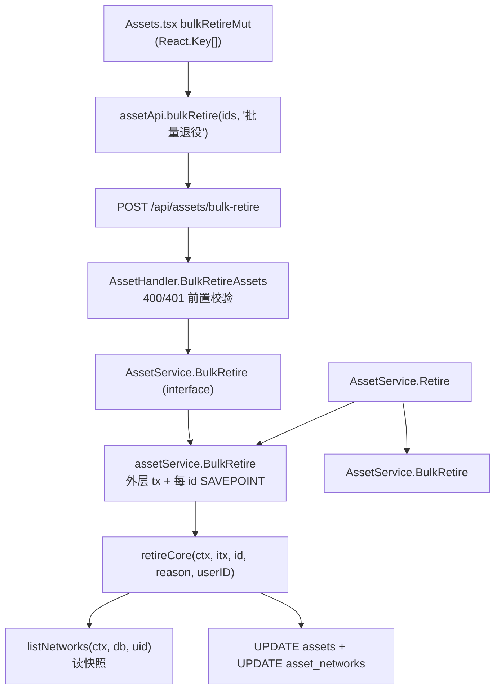

# M58 双轨分析 (CodeGraph + Graphify)

**Generated**: 2026-09-15 CST (after M58 四笔 feat/test commit `f0c3d47` / `3dfe6d4` / `6a3a3b2` / `b2a50dc`)
**Scope**: M58 G-Asset-BulkRetireEndpoint（backend 4 files + frontend 4 files，含 openapi.yaml 与生成物 api.types.ts）
**Tools**: `graphify` v0.9.58, `codegraph` v1.6.0

## Graphify

**`graphify update . --force`**: ✓
- 6771 nodes / 13849 edges / 443 communities（M57 基线 6720 / 13768 / 440）
- AST extraction: 113/113 files（100%）

**`graphify diagnose multigraph`**: ✓ **0 anomalies**
- `missing_endpoint_edges: 0` / `dangling_endpoint_edges: 0`
- `self_loop_edges: 0` / `exact_duplicate_edges: 0`
- `undirected_same_endpoint_collapsed_edges: 0` / `relation_variant_groups: 0`
- `producer_suppression_sites: 12`（`seen_ids`/`seen_keys`/`seen_doc_refs` arity=unknown，与 M57 同源，非本轮引入）

## CodeGraph

**`codegraph sync`**: `Already up to date`（watcher 已在新 commit 后追上）
新符号已入索引，`codegraph_explore "BulkRetire BulkRetireAssets bulk-retire assetApi.bulkRetire"` 返回 54 symbols / 5 files：

| 符号 | 位置 | blast radius |
|---|---|---|
| `BulkRetireAssets` | `backend/internal/api/handlers/asset_handler.go:210` | 2 callers in `routes.go`；tests: `asset_handler_test.go` |
| `BulkRetire` | `backend/internal/service/asset_service.go:322` | `AssetService` 接口实现（handler 经接口调用）；tests: `asset_service_test.go` |
| `assetApi.bulkRetire` | `frontend/src/services/api.ts:128` | `assetApi` 有 6 callers（AppBreadcrumb / AssetTable / CommandPalette / Assets） |
| `parseBulkRetireResult` | `frontend/src/pages/Assets.tsx:41` | 1 caller（同文件 `bulkRetireMut`） |

## M58 影响面（调用链）

- 单条 `Retire` 与 `BulkRetire` 现在**共用** `retireCore`：退役语义（`last_known_ip*` 快照 / 清空网卡 IP / 拒绝重复退役）只有一份实现，不会分叉。
- 静态段 `/assets/bulk-retire` 与 `/assets/:id/retire` 是**同一 gin 树的兄弟节点**，注册次序决定谁接走 `POST /assets/bulk-retire`；两条路由级测试（handlers 调用面 + routes_integration 状态码）都覆盖了这一点。
- `openapi.yaml` → `api.types.ts` 是 CI 硬门禁的一条生成物链（漂移检查 `git diff --exit-code`）。

## 验证链完整性

| 验证维度 | 结果 |
|---|---|
| backend 全量 | ✓ `go test -count=1 ./...` 27 packages ok（0 fail） |
| frontend 单测 | ✓ 42 files / 386 tests PASS（Assets 26 含 M58 新 6） |
| tsc | ✓ 0 error |
| eslint（改动 3 文件） | ✓ 干净 |
| mutation inversion（前端） | ✓ bypass 批量路径 → 5 failed \| 1 passed |
| mutation inversion（后端） | ✓ 去 per-id SAVEPOINT → 3 failed |
| 契约门禁（集合相等） | ✓ openapi.yaml 已补 → `TestRoutes_OpenAPI契约集合相等` 绿 |
| 生成物漂移检查 | ✓ `gen:api` 后 zero diff（含修 M38-B 起就红的既存漂移） |
| graphify diagnose | ✓ 0 anomalies（0 missing / 0 dangling / 0 self_loops / 0 collapses） |
| codegraph index | ✓ 新符号已入图（blast radius 可见） |
| TODO + CHANGELOG | ✓ ship（M58 段在 M57 之前） |

## 本轮无新增 trap

未发现新的「跨语言裸字符串约定」「两侧语义分叉」「生成物漂移」类陷阱。
`retireCore` 的事务边界变更（读进事务）已在 CHANGELOG 与 completion report §2 显式记录为**行为变更**，
而不是当作纯重构 —— 这是本轮唯一会影响既有 SQL 时序的改动。
