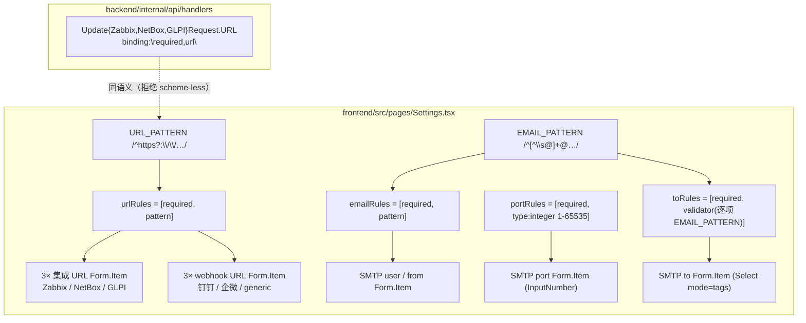

# M59 双轨分析 (CodeGraph + Graphify)

**Generated**: 2026-09-15 CST (after M59 三笔 commit `41cb378` feat frontend / `8d99503` test frontend / `3e4034a` feat+test backend)
**Scope**: M59 G-UI-SettingsValidators（frontend 2 files + backend 2 files）
**Tools**: `graphify` v0.9.58, `codegraph` v1.6.0

## Graphify

**`graphify update . --force`**: ✓
- 6809 nodes / 13893 edges / 441 communities（M58 基线 6771 / 13849 / 443）
- AST extraction: 107/107 files（100%）

**`graphify diagnose multigraph`**: ✓ **0 anomalies**
- `missing_endpoint_edges: 0` / `dangling_endpoint_edges: 0`
- `self_loop_edges: 0` / `exact_duplicate_edges: 0`
- `directed_same_endpoint_collapsed_edges: 0` / `undirected_same_endpoint_collapsed_edges: 0`
- `relation_variant_groups: 0` / `context_variant_groups: 0`
- `unverified_code_nodes: 0`
- `producer_suppression_sites: 12`（`seen_ids`/`seen_keys`/`seen_doc_refs` arity=unknown，与 M58 同源，非本轮引入）

> 本轮新增的 5 个导出常量（`URL_PATTERN` / `EMAIL_PATTERN` / `urlRules` / `emailRules` / `portRules` /
> `toRules`）是**叶子节点**：无出边，消费者是同一文件里的 Form.Item JSX。故节点/边增长（+38 / +44）
> 主要来自测试文件的用例函数，社区数反而 -2（并入既有 Settings 社区）。

## CodeGraph

**`codegraph sync`**: `Already up to date`（watcher 已在三笔 commit 后追上）

新符号已入索引，`codegraph_explore "urlRules emailRules portRules toRules URL_PATTERN EMAIL_PATTERN UpdateNetBoxRequest"`
返回 13 symbols / 3 files：

| 符号 | 位置 | blast radius |
|---|---|---|
| `URL_PATTERN` | `frontend/src/pages/Settings.tsx:24` | 2 callers（`urlRules` + 测试 `Settings.test.tsx` import） |
| `EMAIL_PATTERN` | `frontend/src/pages/Settings.tsx:25` | 2 callers（`emailRules` + `toRules` validator） |
| `urlRules` | `frontend/src/pages/Settings.tsx:26` | 6 处 Form.Item（3 集成 URL + 钉钉 + 企微 + generic） |
| `emailRules` | `frontend/src/pages/Settings.tsx:30` | 2 处 Form.Item（SMTP user / from） |
| `portRules` | `frontend/src/pages/Settings.tsx:34` | 1 处 Form.Item（SMTP port） |
| `toRules` | `frontend/src/pages/Settings.tsx:40` | 1 处 Form.Item（SMTP to, tags 数组） |
| `UpdateNetBoxRequest` | `backend/internal/api/handlers/integration_handler.go:204` | `binding:"required,url"`（URL 字段） |

`codegraph` 对 `urlRules` / `emailRules` / `portRules` / `toRules` 报「no tests within 3 caller hops」——
它们的消费者是 JSX prop（`rules={…}`），不是函数调用边；行为覆盖走 `URL_PATTERN`（有测试边）
与 UI 断言（`Settings.test.tsx` 直接 render 组件）。这是静态图的分辨率边界，不是覆盖缺口。

## M59 影响面（调用链）

- 前端规则是**单一事实来源**：6 处 URL 字段共用一个 `urlRules` 对象（改 pattern 不会漏掉某处）；
  `URL_PATTERN` / `EMAIL_PATTERN` 被 export，测试直接 import 钉正/负样本。
- 后端 `binding:"required,url"` 与前端 `URL_PATTERN` **不是同一语义**：gin/validator 的 `url` 只要求
  「scheme + host」（`ftp://` 也过），前端 pattern 只允许 http(s)。两者方向一致（都挡住 scheme-less），
  但强度不同 —— 已写入 `integration_handler.go` 的注释，避免后人误以为后端做了 http(s) 白名单。

## 验证链完整性

| 验证维度 | 结果 |
|---|---|
| frontend `npx tsc --noEmit` | ✓ 0 error |
| frontend Settings.test.tsx | ✓ 58 tests PASS（基线 35 → +23：7 UI + 16 pattern 边界） |
| frontend 全量 `npx vitest run` | ✓ 42 files / 409 tests PASS（基线 386，0 退化） |
| eslint（改动 2 文件） | ✓ 干净（`--max-warnings 0`） |
| backend `go test -count=1 ./...` | ✓ 27 packages ok（0 fail） |
| backend `gofmt -l` | ✓ 无输出 |
| mutation inversion（前端 bypass 接线） | ✓ bypass Zabbix `rules={urlRules}` → **1 failed**（正是该用例） |
| mutation inversion（前端放宽 pattern） | ✓ `EMAIL_PATTERN = /^.*$/` → **7 failed**（2 UI + 5 边界） |
| mutation inversion（后端去 binding） | ✓ 去掉 `,url` → `TestUpdateIntegrations_非URL_返400/netbox` **FAIL** |
| graphify diagnose | ✓ 0 anomalies（0 missing / 0 dangling / 0 self_loops / 0 collapses） |
| codegraph index | ✓ 新符号已入图（blast radius 可见） |
| TODO + CHANGELOG | ✓ ship（M59 段在 M58 之前） |

## 本轮 trap（登记，未新增代码）

**T-56（跨语言语义近似）**：`binding:"url"` 与前端 `^https?://` **形似而不同集** —— 前者接受
`ftp://example.com`（有 scheme + host 即可），后者不接受。两侧都叫「URL 校验」但不是同一条规则。
风险不是「漏挡」（两者都挡 scheme-less），而是**误以为后端已做「只允许 http(s)」**，于是前端被
绕过时（API 直连）写入 `ftp://` 配置。已用代码注释 + 测试
（`TestUpdateIntegrations_内网URL_不被url标签拒` 钉住「validator 的实际强度」）显式化；
真正的 http(s) 白名单需自定义 validator，留 future（见 completion report Follow-up）。
