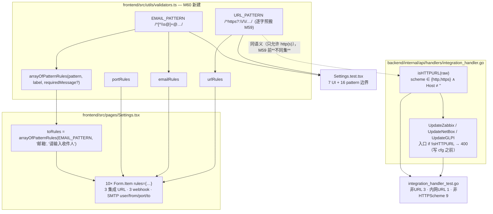

# M60 双轨分析 (CodeGraph + Graphify)

**Generated**: 2026-09-15 CST（M60 四笔 commit：`314d47b` feat frontend validators / `a3867ff` refactor Settings import / `64c9623` feat backend 白名单 / `549ddb5` test backend）
**Scope**: M60 G-Utils-ValidatorsShared + G-BE-HttpsWhitelist（frontend 3 files + backend 2 files）
**Tools**: `graphify` v0.9.58, `codegraph` v1.6.0

## Graphify

**`graphify update . --force`**: ✓
- **6843 nodes / 13936 edges / 445 communities**（M59 基线 6809 / 13893 / 441）
- AST extraction: 112/112 files（100%）
- 社区集变化：441 个旧标签 + 445 communities → 82 个社区按 hub 重命名（`graphify label` 可刷新 LLM 名称，本轮未跑）

**`graphify diagnose multigraph`**: ✓ **0 anomalies**
- `missing_endpoint_edges: 0` / `dangling_endpoint_edges: 0`
- `self_loop_edges: 0` / `exact_duplicate_edges: 0`
- `directed_same_endpoint_collapsed_edges: 0` / `undirected_same_endpoint_collapsed_edges: 0`
- `relation_variant_groups: 0` / `context_variant_groups: 0` / `source_file_variant_groups: 0`
- `unverified_code_nodes: 0`
- `producer_suppression_sites: 12`（`seen_ids`/`seen_keys`/`seen_doc_refs` arity=unknown，与 M59 同源，非本轮引入）

> 本轮节点/边增量（+34 / +43）主要来自测试文件（后端 +1 个表驱动用例及其 9 个 sub-case 名）
> 与新模块 `validators.ts`（6 个导出常量/函数）。社区数 +4：`utils/validators` 自成一个前端工具社区，
> Settings 的 rules 消费者社区因「规则搬家」重算。

## CodeGraph

**`codegraph sync`**: `Already up to date`（watcher 已在四笔 commit 后追上）

`codegraph explore "arrayOfPatternRules validators.ts isHTTPURL integration_handler.go"` → 62 symbols / 3 files，关键两条：

| 符号 | 位置 | blast radius |
|---|---|---|
| `arrayOfPatternRules` | `frontend/src/utils/validators.ts:37` | 1 caller（`Settings.tsx:22` 构造 `toRules`）+ 测试边（`Settings.test.tsx`） |
| `isHTTPURL` | `backend/internal/api/handlers/integration_handler.go:47` | 3 callers（`UpdateZabbix` / `UpdateNetBox` / `UpdateGLPI`）+ 测试边（`integration_handler_test.go`） |

`URL_PATTERN` / `EMAIL_PATTERN` / `urlRules` / `emailRules` / `portRules` 仍是**叶子节点**（无出边）：
消费者是 Form.Item 的 JSX prop（`rules={…}`），静态图看不到调用边 —— 与 M59 同一条分辨率边界；
行为覆盖由 `Settings.test.tsx` 的 7 条 UI 用例 + 16 条 pattern 边界 + 后端 12 条用例承担。

## M60 影响面（调用链）

- 前端 side：规则搬家**没改变 10 处 Form.Item 的引用**（同一份 rules 对象），文案逐字不变 ——
  `Settings.test.tsx` 58/58 PASS 是这条「纯搬家」声明的证据。
- 后端 side：M59 的 `binding:"url"` 与 M60 的 `isHTTPURL` 是**替换**关系，不是叠加 ——
  两条语义不同的校验并存正是 T-56 的病灶（校验器接受的形态必须有消费者按该形态消费，T-52 同族）。
- 前后端现在**同集**：只允许 http(s)，且都允许内网无 TLD（`http://zabbix:8080` 由两侧测试各自钉住）。

## 验证链完整性

| 验证维度 | 结果 |
|---|---|
| frontend `npx tsc --noEmit` | ✓ 0 error |
| frontend `src/pages/Settings.test.tsx` | ✓ 58 tests PASS（无退化） |
| frontend 全量 `npx vitest run` | ✓ 42 files / 409 tests PASS（与 M59 基线一致，零退化） |
| eslint（改动 3 文件，`--max-warnings 0`） | ✓ 干净 |
| backend `go test -count=1 ./...` | ✓ 27 packages ok（0 fail） |
| backend `gofmt -l`（改动 2 文件） | ✓ 无输出 |
| mutation inversion（后端短路 3 处 scheme 闸） | ✓ 9/9 新 sub-case FAIL + M59 3/3 non-URL FAIL，还原后全绿 |
| graphify diagnose | ✓ 0 anomalies（0 missing / 0 dangling / 0 self_loops / 0 collapses） |
| codegraph index | ✓ 新符号已入图（`arrayOfPatternRules` 1 caller / `isHTTPURL` 3 callers，均带测试边） |
| TODO + CHANGELOG | ✓ ship（M60 段在 M59 之前） |

## 本轮 trap 记录

> 编号说明：`T-56` / `T-71` 是**轮次内编号**（M59 intent / M60 intent 沿用），
> 与 `docs/TRAPS.md` 的 `T-56`（凭据脱敏串联）**不是同一条**；`docs/TRAPS.md` 走审计时统一更新，
> 按 M51/M52 的惯例，本轮新 trap 记在 CHANGELOG + completion report。

**T-56（跨语言「同名校验」不同集）—— 本轮修复，语义化**：`binding:"url"`（validator v10.16）与前端
`^https?://` 都叫「URL 校验」，实际集不同：前者 = 「有 scheme + host」（RFC 3986 §3.1 泛 URI），
后者 = 「scheme 必须是 http(s)」。风险形态是**误以为后端已做 http(s) 白名单**，于是绕过前端的调用路径
（API 直连 / 脚本）写入 `ftp://` / `file://` 配置，运维要等下次同步失败才发现。修法不是「再叠一条校验」
而是**替换**：scheme 判定收敛到单一 `isHTTPURL`，binding 退回 `required`（只管空值）。

**T-71（写了但不起作用的校验）—— 本轮提取并固化**：antd 的 `{ pattern }` 规则只作用于**字符串**值，
对数组（`Select mode="tags"`）**静默不生效** —— 规则看着在、永不触发、无报错无警告。
`arrayOfPatternRules` 把「逐项 `validator`」变成唯一写法；第三参 `requiredMessage` 存在的理由
（收件人 label ≠ 邮箱）也写进注释，防止后人「简化」掉它而撞坏 M6 文案断言。
