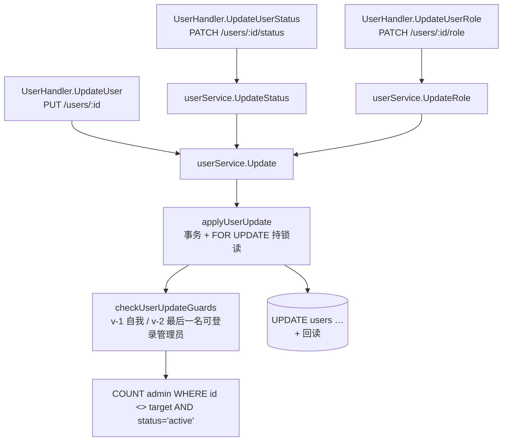
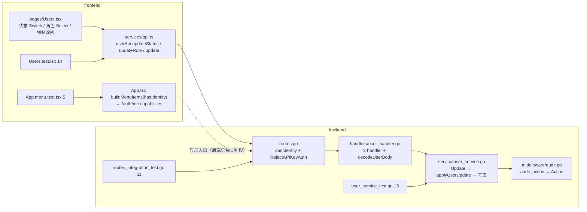

# M61 双轨分析 (CodeGraph + Graphify)

**Generated**: 2026-09-15 CST（M61 六笔 commit：`4d7092c` feat service / `1c85490` test service / `5012582` feat handler+契约 / `4a7f407` test 路由集成 / `969db3e` feat 前端页 / `5249fd9` test 前端）
**Scope**: M61 G-User-AdminManagement（backend 5 files + frontend 7 files，含 openapi.yaml 与生成物 api.types.ts）
**Tools**: `graphify` v0.9.58, `codegraph` v1.6.0

## Graphify

**`graphify update . --force`**: ✓
- **6968 nodes / 14363 edges / 443 communities**（M60 基线 6843 / 13936 / 445）
- AST extraction: 122/122 files（100%）
- 社区集变化：445 → 443（-2）。`pages/Users.tsx` 自成一个前端页面社区；后端新增的
  `user_service.go` 写路径与前端的 `userApi` 写方法跨语言**不相邻**（Go 与 TS 各在自己社区里），
  符合本仓既有形态（跨语言契约靠 openapi.yaml，不靠图邻接）。

**`graphify diagnose multigraph`**: ✓ **0 anomalies**
- `missing_endpoint_edges: 0` / `dangling_endpoint_edges: 0`
- `self_loop_edges: 0` / `exact_duplicate_edges: 0`
- `directed_same_endpoint_collapsed_edges: 0` / `undirected_same_endpoint_collapsed_edges: 0`
- `relation_variant_groups: 0` / `context_variant_groups: 0` / `source_file_variant_groups: 0` / `source_location_variant_groups: 0`
- `unverified_code_nodes: 0`
- `producer_suppression_sites: 12`（`seen_ids`/`seen_keys`/`seen_doc_refs` arity=unknown，与 M59/M60 同源，非本轮引入）

> 本轮增量 +125 节点 / +427 边，来源集中在两处：① 后端 `user_service.go` 新增写路径
> （`Update`/`UpdateStatus`/`UpdateRole`/`applyUserUpdate`/`checkUserUpdateGuards` 及其
> 事务/守卫调用边）与 `user_handler.go` 三条 handler + `decodeUserBody`/`userPathID`/`writeUser`；
> ② 前端新页面 `pages/Users.tsx`（19 个符号）与两个新测试文件（`Users.test.tsx` 14 用例、
> `App.menu.test.tsx` 5 用例的用例名节点）。

## CodeGraph

**`codegraph sync`**: watcher 已在六笔 commit 后追上（explore 返回的是磁盘当前版本）

**`codegraph explore "UserService Update UpdateStatus UpdateRole checkUserUpdateGuards UpdateUser userPathID decodeUserBody buildMenuItems Users.tsx applyPatch rollback"`**
→ 50 symbols / 5 files，关键三条：

| 符号 | 位置 | blast radius |
|---|---|---|
| `Update` | `backend/internal/service/user_service.go:97` | 1 caller（`applyUserUpdate`）… 反向：`UpdateStatus`/`UpdateRole` 两个窄入口 + `UserHandler.UpdateUser` |
| `applyUserUpdate` | `backend/internal/service/user_service.go:144` | 1 caller（`Update`）+ 测试边（`user_service_test.go` 的 FOR UPDATE 用例） |
| `checkUserUpdateGuards` | `backend/internal/service/user_service.go:190` | 1 caller（`applyUserUpdate`）+ 测试边（`user_service_test.go` 13 条守卫/词表用例、`routes_integration_test.go` 的 403 用例） |

调用链（图自动给出，无需人工重建）：

- **`checkUserUpdateGuards` 的 1 caller 是图上的真实调用面**，但它的行为覆盖来自**13 条 service 单测 +
  3 条路由集成用例** —— 这些边在 codegraph 里表现为测试文件内的调用（`UpdateStatus` 等公开入口），
  不是对私有函数的直接调用。这正是「按公开入口测」的代价与收益：图看不出守卫被多少用例打到，
  但把守卫短路掉（mutation ①）会让两个包**同时**变红，可证覆盖真实存在。
- **前端侧**：`buildMenuItems`（`frontend/src/App.tsx:82`）是从 `AppLayout` 里抽出的导出纯函数，
  blast radius = 1 caller（`AppLayout`）+ 测试边（`App.menu.test.tsx`）——
  抽取的理由与 `buildTheme` 同源：条件渲染写错的表现（入口该有却没有 / 不该有却出现）人工不易发现，
  需要能被断言。
- `pages/Users.tsx` 的 `applyPatch` / `rollback` 是组件内闭包（无导出），codegraph 把它们收在
  `Users` 的局部作用域里**不作为独立节点建边** —— 与 M49/M59 同一条分辨率边界；其行为由
  `Users.test.tsx` 的 4 条回滚/乐观用例承担。

## M61 影响面（调用链）

- **前端入口按能力显示，后端仍独立判权**：菜单门禁（虚线）与路由门禁（实线）是**两条独立的判据** ——
  这正是 `roles.go` 警告的「按钮隐藏但接口放行」错位的反面：前端藏入口是为了少让人点进 403，
  而不是访问控制。两者都从 `/auth/me` 的 `capabilities` 出发（不复制矩阵），但**互不依赖**。
- **契约是跨语言的唯一连接**：`openapi.yaml` 三条新 path 是前端与后端之间唯一的机器可校验接口，
  CI 的「生成物漂移检查」（`gen:api` + `git diff --exit-code`）与 `TestRoutes_OpenAPI契约集合相等`
  （集合相等，无 allowlist）分别守住两个方向。

## 验证链完整性

| 验证维度 | 结果 |
|---|---|
| backend `go test -count=1 ./...` | ✓ 27 packages ok（0 fail；M60 同基线） |
| backend `gofmt -l internal cmd` | ✓ 仅 3 个 M61 **未触碰**的既存文件；本轮改动的 5 个 Go 文件干净 |
| backend `go vet ./...` | ✓ 干净 |
| frontend `npx tsc --noEmit` | ✓ 0 error |
| frontend `npm run lint`（全量 `--max-warnings 0`） | ✓ 干净 |
| frontend `src/pages/Users.test.tsx` | ✓ 14 tests PASS |
| frontend `src/App.menu.test.tsx` | ✓ 5 tests PASS |
| frontend 全量 `npx vitest run` | ✓ **44 files / 428 tests PASS**（M60 基线 42/409 → +2 文件 +19 测试，零退化） |
| mutation inversion ①（自我守卫短路） | ✓ 4 FAIL：`_自我禁用返回ErrForbidden` / `_自我降级admin返回ErrForbidden` / `_还有另一名启用admin时可禁用` + 集成 `_自我禁用返403` |
| mutation inversion ②（守卫 count 去掉 `status='active'`） | ✓ 1 FAIL：`_被禁用的管理员不算能自救` |
| mutation inversion ③（`Update` 去掉 `CanonicalRole` 折叠） | ✓ 2 FAIL：`_role首尾空白与大小写归一` / `_role遗留别名折叠后才落库` |
| mutation inversion ④（前端 bypass `statusMut.mutate`） | ✓ 1 FAIL：`禁用账号…PATCH /users/:id/status` |
| mutation inversion ⑤（全部还原后复跑） | ✓ service 包 ok、`Users.test.tsx` 14/14 |
| openapi 校验 + 生成物 | ✓ `validate:api` valid；`gen:api` 重生成随提交（差异仅新增 path/schema 与 `UserList.data` 的形状修正） |
| graphify diagnose | ✓ 0 anomalies（0 missing / 0 dangling / 0 self_loops / 0 collapses） |
| codegraph index | ✓ 新符号已入图（`checkUserUpdateGuards` 调用链、`buildMenuItems` 测试边） |
| TODO + CHANGELOG | ✓ ship（M61 段在 M60 之前；G-4 结案） |

## 本轮 trap 记录

> 编号说明：`T-72` 是**轮次内编号**（沿用 M59/M60 的 intent 编号习惯），与 `docs/TRAPS.md` 的同号条目
> **不是同一条**；按 M51/M52 的惯例，本轮新 trap 记在 CHANGELOG + completion report。

**T-72（写了但不生效的字段）—— 本轮提取并固化**：`models.User` 的注释写
`status: active, inactive, locked`，而**鉴权侧只有两个消费者**（`middleware/auth.go` 的 JWT 与
API Key 路径、`auth_handler.go` 的登录分支）判的都是 `status == "inactive"`。
若把 `locked` 收进可写词表，管理员会得到一个「点了以后对方照样能登录」的开关 ——
无报错、无警告、看起来可控。故 `userStatusValues` 只收 `active`/`inactive`，并在
openapi 的 `status` enum 里把三值收全**但注明可写只有两值**（如实描述存量库的读侧形态，
不让契约比实现更宽也不敢更窄）。同族先例：T-71（antd 数组上的 `pattern` 规则永不触发）、
G-39（`AlertRule.NotifyChannels` 只写不读）。

**T-73（同一动词的不同业务动作在审计里不可区分）—— 本轮提取并固化**：
`middleware/audit.go` 的默认 `ActionFunc` 取 HTTP method，于是
`PATCH /users/:id/status` 与 `PATCH /users/:id/role` 在审计表里都是 `PATCH`——
「谁把谁提成了 admin」与「谁禁用了谁」在动作列上分不出来，取证时要靠 path 猜。
修法是 handler 用 context 键 `audit_action` 覆写（单个 `c.Set`，不给每条路由单独挂
`AuditLog` 实例 —— 后者会让每个请求**写两行**审计，因为组级实例也在跑）。
连带修掉 `Action` 字段此前不截断（列宽 varchar(50)）：默认值 HTTP method 是定长安全的，
而覆写路径进来的字符串完全没有宽度约束 → 超宽即 22001 → **整行**审计丢失（G-44 同族）。

**T-74（守卫条件里的隐含状态前提）**：「最后一名管理员」的判据若只数
`role='admin' AND id <> target`，一个 `status='inactive'` 的 admin 会被算作「能自救的那个人」——
而它**登不进来**（鉴权侧拦 inactive），于是禁用最后一个可登录的 admin 会被放行，系统失去
唯一的自救入口。判据必须是「还有**能登进来**的 admin」，`status='active'` 这个条件不是优化而是
正确性（mutation ② 专门钉住它）。同族：`cmd/set-role` 的防自锁判据少了这层时也有同样的洞
（该命令只判 role —— 但它跑在运维终端、无 HTTP 面，登记在 TODO「`cmd/set-role` 并发窗口」一行附近，
本轮**不改**：减少的是人工路径的攻击面，不是自动路径）。

## 未覆盖的残余（如实登记，不假装完整）

- **并发窗口**：守卫与写入同事务 + `FOR UPDATE` 在真 PG 上是行锁；**sqlite 基座不渲染 FOR UPDATE**，
  故单测只验到「SQL 文本里有 FOR UPDATE」（sqlmock + postgres dialector），
  真并发下两个请求双双通过守卫的场景**没有在真 PG 上实测**。同 `cmd/set-role` 的既有登记
  （TODO：「`cmd/set-role` 并发窗口」）——降级路径需要两把真连接 + 精确定时，属独立测试工程。
- **30s 状态缓存**：禁用生效的滞后由 `middleware/auth_status_cache.go` 的 per-process TTL 决定，
  集成用例用 `InvalidateAuthStatusCacheForUser` **模拟过期**而非等待（真 PG 冒烟不能 sleep 31s）。
  多副本下每个副本各自到期，UI 文案与 openapi description 都如实写了 ≤30s。
- **`user_roles` 关联表未同步**：`cmd/set-role` 会同步 `user_roles`（`syncUserRoles`），
  HTTP 路径**只改 `users.role`**。理由：该表运行时零读取（`docs/FIX-PLAN-AUTHZ.md` §7 已 grep 核实），
  同步它属「维护一张没人读的表」；一旦将来有读取方，两条路径必须收敛到同一个 helper——
  本轮在 `UpdateRole` 的注释里登记，不在 scope 内引入第二份同步实现。
- **`GET /auth/me` 的调用时机**：`AppLayout` 挂载时取一次能力集（无轮询）。角色被改后，
  侧边栏入口最长要等下次登录/刷新才更新；后端判权是每请求实时（JWT claim），不依赖这个缓存。
