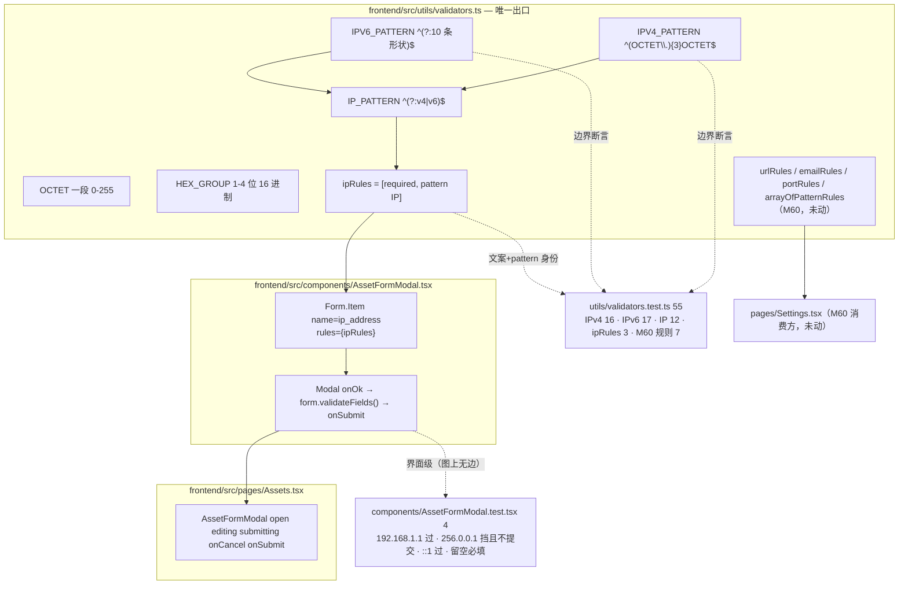

# M62 双轨分析 (CodeGraph + Graphify)

**Generated**: 2026-09-15 CST（M62 四笔 commit：`1e460fc` feat validators ipRules /
`f738bc7` test validators / `c592512` feat AssetFormModal / `9be9576` test AssetFormModal；docs 本次）
**Scope**: M62 G-UI-AssetIpValidator（frontend 4 files；backend 零改动）
**Tools**: `graphify` v0.9.58, `codegraph` v1.6.0

## Graphify

**`graphify update . --force`**: ✓
- **7002 nodes / 14420 edges / 453 communities**（M61 基线 6968 / 14363 / 443 → **+34 / +57 / +10**）
- AST extraction: 113/113 uncached files（100%）
- 社区标签：443 个旧标签 + 453 communities → **79 个社区按 hub 重命名**（`graphify label` 可刷新 LLM 名称，本轮未跑）

**`graphify diagnose multigraph`**: ✓ **0 anomalies**
- `missing_endpoint_edges: 0` / `dangling_endpoint_edges: 0`
- `self_loop_edges: 0` / `exact_duplicate_edges: 0`
- `directed_same_endpoint_collapsed_edges: 0` / `undirected_same_endpoint_collapsed_edges: 0`
- `relation_variant_groups: 0` / `context_variant_groups: 0` / `source_file_variant_groups: 0` / `source_location_variant_groups: 0`
- `unverified_code_nodes: 0`
- `producer_suppression_sites: 12`（`seen_ids`/`seen_keys`/`seen_doc_refs` arity=unknown，与 M59/M60/M61 同源，非本轮引入）

### 社区归属（本轮的关键观察）

| 社区 | hub 标签 | 规模 | 本轮相关节点 |
|---|---|---|---|
| **91** | `Settings.tsx` | 32 | `validators.ts` 的**全部** code 节点：`URL_PATTERN` / `EMAIL_PATTERN` / `urlRules` / `emailRules` / `portRules` / `arrayOfPatternRules` / **`IPV4_PATTERN` / `IPV6_PATTERN` / `IPV6_BODIES` / `IP_PATTERN` / `ipRules`** + `validators.test.ts` + concept 节点 `RFC-4291` |
| **16** | `api.ts` | 53 | `AssetFormModal.tsx` 全部符号（含文件节点）+ **`AssetFormModal.test.tsx`**（`fillForm()` + 文件节点） |
| 385 | `任务` | 8 | `intent-M62.md` 的文档节点（把本轮 4 个文件按名字引用） |

- **反向证据**：新增 IP 规则**没有**分叉出第二个社区 —— 11 个新/旧的规则符号与两个测试文件
  仍然同属社区 91。这正是「规则唯一出口」在图上的形态：`ipRules` 与 `urlRules` 是**同一个簇**，
  不是「Settings 的规则」+「资产页另抄的规则」两份。
- 社区 16 同时收 `AssetFormModal.tsx` 与其新测试 —— 组件与其界面级用例同簇（M50 起同一形态）。
- 注释里提到的 `RFC 4291 §2.2` 被抽成一个 `concept` 节点（`source_file=validators.ts:42`）：
  **文档引用也进图**，于是「这条 pattern 的形状族依据哪份 RFC」是可被追溯的（不是口头约定）。
- `+10` 社区的增量里，除本轮（IP 规则与两个测试文件）外还包含 `dac8b05`（他人）带来的
  `App.render.test.tsx`；本轮自身不新增前端页面社区（未新增 page）。

## CodeGraph

**`codegraph sync`**: watcher 已追上（explore 返回的是磁盘当前版本 —— 新测试文件源码原样可见）

`codegraph explore "ipRules IP_PATTERN IPV4_PATTERN IPV6_PATTERN validators.ts AssetFormModal urlRules portRules arrayOfPatternRules"` → 20 symbols / 2 files（另一次查询 40 symbols / 5 files），关键 blast radius：

| 符号 | 位置 | blast radius |
|---|---|---|
| `ipRules` | `frontend/src/utils/validators.ts:72` | **2 callers in `AssetFormModal.tsx`**（import + JSX `rules={ipRules}`）+ 测试边（`validators.test.ts`） |
| `IP_PATTERN` | `frontend/src/utils/validators.ts:70` | 2 callers in `validators.ts`（`ipRules` 的 pattern）+ 测试边 |
| `IPV4_PATTERN` | `frontend/src/utils/validators.ts:66` | 1 caller + 测试边 |
| `IPV6_PATTERN` | `frontend/src/utils/validators.ts:68` | **无 in-repo 消费者**（只有 `validators.test.ts` 的边界断言读它；`IP_PATTERN` 用的是 `IPV6_BODY`） |
| `urlRules` / `emailRules` / `portRules` / `arrayOfPatternRules` | `validators.ts:19/23/27/86` | 各 2 callers in `Settings.tsx`（M60 原状，未动）+ 测试边（`Settings.test.tsx`、`validators.test.ts`） |

- **dynamic-dispatch 边**：`Assets → AssetFormModal [dynamic: renders <AssetFormModal>]` —— 生产侧
  唯一渲染点（`Assets.tsx:466`），与 M50 以来同一形态。
- **图上看不见的那条边（如实登记）**：`codegraph` 只把 `ipRules` 的测试边指到 `validators.test.ts`，
  **没有** `AssetFormModal.test.tsx → ipRules` 的边 —— 界面级用例经「render 组件」间接打到规则，
  不构成静态调用（`Assets → AssetFormModal` 的那条 render 边也只在生产侧）。所以
  「`ipRules` 真的被界面用上了」这件事**不是图给的，是 mutation ①给的**（bypass `rules={ipRules}`
  → `256.0.0.1` 用例 FAIL）。这正是 `M60-graph-analysis.md` 里同一条分辨率边界的延续：
  规则对象的消费者是 JSX prop，静态图到此为止。
- `IPV6_PATTERN` 无消费者这件事**不是缺陷**（它是模块对外声明的边界样本，被 55 条用例中的 17 条
  直接读），但按 T-72 的口径登记：**导出但无人消费的符号**要么有用例钉住、要么该删 —— 这里是前者。

## M62 影响面（调用链）

- **两条测试打的是同一条闸的不同层**：`validators.test.ts` 钉规则本身（含 `256.0.0.1` 这类
  「形状对、地址错」），`AssetFormModal.test.tsx` 钉「组件真的把规则挂上去了」——
  mutation ①（bypass `rules={ipRules}`）只让后者红、mutation ②（放宽 `OCTET`）让两层同时红，
  这就是两层用例**不同输入、同一规则**的证据（M60 同款论证）。
- **跨语言方向**：本轮**不碰后端**。如实登记：`assets` 表没有 IP 列，IP 存于
  `asset_networks.ipv4_address`（`VARCHAR(45)`，由 `000013_schema_align` 从 `INET` 转来），
  而 `GET /assets` 不投影它、`POST /assets` 的 `ip_address` 在 `ShouldBindJSON` 阶段被丢弃 ——
  见 completion report「残余」与 TODO 新登记条目。**本轮的前端闸改变的是「表单能否提交」，
  不是「值是否落库」**；这两件事本轮被明确拆开，不假装前者解决了后者。

## 验证链完整性

| 验证维度 | 结果 |
|---|---|
| frontend `npx tsc --noEmit` | ✓ 0 error |
| frontend `npx vitest run src/utils/validators.test.ts` | ✓ 55 tests PASS |
| frontend `npx vitest run src/components/AssetFormModal.test.tsx` | ✓ 4 tests PASS |
| frontend `npx vitest run src/pages/Settings.test.tsx` | ✓ 58 tests PASS（未触碰，无退化） |
| frontend 全量 `npx vitest run` | ✓ **47 files / 489 tests PASS**（M62 前 45 files / 430 tests，零退化） |
| eslint（改动 4 文件，`--max-warnings 0`） | ✓ 干净 |
| mutation inversion ①（`rules={ipRules}` → required-only） | ✓ `AssetFormModal.test.tsx` **1 failed \| 3 passed** |
| mutation inversion ②（`OCTET` → `\d{1,3}`，= 旧的形状检查） | ✓ `validators.test.ts` **4 failed** + `AssetFormModal.test.tsx` **1 failed** |
| mutation inversion ③（`IPV6_PATTERN` 换回 brief 单行字面量） | ✓ `validators.test.ts` **6 failed**（`zz::1` / `:::` / `a::b::c` / `12345::1` / `gggg::1` / `fe80::1%eth0`） |
| mutation reversal（三处全部还原） | ✓ 59/59 PASS（两个文件合跑），`git status` 干净 |
| pattern 等价性核对（结构化拼装 vs brief 字面量） | ✓ 336,949 样本：IPv4/IP_PATTERN **零分歧**；IPv6 分歧**单向**（brief 多收 24,558 条子串误判，本实现零误收） |
| graphify diagnose | ✓ 0 anomalies（0 missing / 0 dangling / 0 self_loops / 0 collapses） |
| codegraph index | ✓ 新符号已入图（`ipRules` 2 callers + 测试边；`IP_PATTERN` / `IPV4_PATTERN` 测试边） |
| TODO + CHANGELOG | ✓ ship（M62 段在 M61 之前；另登记一条新 friction） |

## 本轮 trap 记录

> 编号说明：`T-75` 是**轮次内编号**（沿用 M59–M61 的 intent 编号习惯），与 `docs/TRAPS.md`
> 的同号条目**不是同一条**；按 M51/M52 的惯例，本轮新 trap 记在 CHANGELOG + completion report。

**T-75（拼接正则时被外层兜底掩盖的锚点缺失）—— 本轮提取并固化**：brief 给的 IPv6 是
**单行字面量**（10 条交替式用 `|` 连写）。其中 `^([0-9a-fA-F]{1,4}:){1,7}:`（无 `$`，配 `|` 时
只有右侧一半被吃掉）与 `:((:[0-9a-fA-F]{1,4}){1,7}|:)$`（无 `^`）这两条**只带自己那一侧的锚点** ——
`new RegExp` 粘起来之后整个 pattern 在 standalone 使用下退化成**子串**匹配：
`IPV6_PATTERN.test('zz::1') === true`、`test(':::') === true`。
危险点在于它**不总是看不出来**：被 antd 的 `pattern` 规则消费时，antd 用
`value.match(pattern)` 且只判「有没有匹配」→ 同一个 pattern 在表单里表现「正常」
（`zz::1` 反正是错的），而在 `IPV6_PATTERN.test('zz::1')` 这种直接调用里是**错的**。
本轮修法：10 条形状列成数组、**边界只写一次**（外层统一 `^(?:…)$`），并由 `validators.test.ts`
的 17 条 IPv6 断言 + mutation ③ 钉住。同族：T-52（两侧语义必须一致）、T-71（写了但不生效的规则）。
