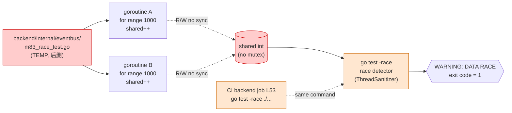
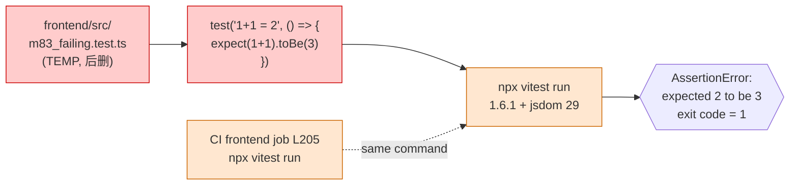
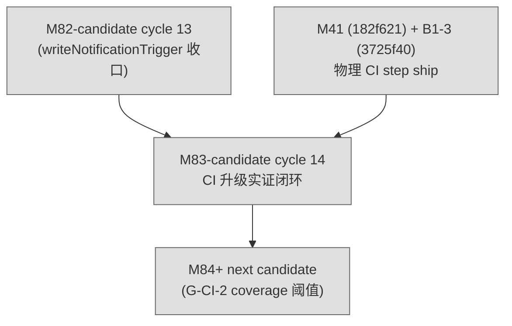

# M83-candidate Graph Analysis — CI 升级 mutation inversion 调用链

> **Round**: M83-candidate (OMH ulw-loop 第 14 cycle, 2026-09-16)
> **Intent**: `intent-M83-candidate.md`
> **Completion**: `M83-candidate-completion-report.md`
> **Layout**: CI workflow 节点图 + mutation inversion 调用链 + cross-cutting 依赖图

## 1. CI workflow 节点图 (`.github/workflows/ci.yml`)

```mermaid
graph TD
  Trigger{{"on: push/PR<br/>branches: [main]"}}

  subgraph Backend["backend job (ubuntu-latest)"]
    B_Checkout["actions/checkout@v7"]
    B_SetupGo["actions/setup-go@v7<br/>go-version-file: backend/go.mod"]
    B_ModDL["go mod download"]
    B_Vet["go vet ./..."]
    B_Race["go test -race ./...<br/>★ M83 mutation M1 实证"]
    B_Build1["go build -o bin/server ./cmd/server"]
    B_Build2["go build -o bin/migrate ./cmd/migrate"]
    B_Build3["go build -o bin/seed ./cmd/seed"]
    B_Upload["upload-artifact@v7<br/>backend-binaries"]
  end

  subgraph DBSmoke["dbsmoke job (postgres:18-alpine)"]
    D_PG[("postgres:18-alpine<br/>port 5432")]
    D_Checkout["actions/checkout@v7"]
    D_SetupGo["actions/setup-go@v7"]
    D_psql["scripts/db_smoke.sh<br/>(fresh install + legacy upgrade)"]
    D_CLIs["3 CLI 迁移路径回归<br/>admin-bootstrap / set-role / seed"]
  end

  subgraph Frontend["frontend job (ubuntu-latest)"]
    F_Checkout["actions/checkout@v7"]
    F_SetupNode["actions/setup-node@v7<br/>node-version: '22'"]
    F_Install["npm ci || npm install"]
    F_Lint["npm run lint"]
    F_TypeCheck["npx tsc --noEmit"]
    F_OpenAPI["OpenAPI 生成物漂移检查<br/>npm run gen:api + git diff"]
    F_Vitest["npx vitest run<br/>★ M83 mutation M2 实证"]
    F_Build["npm run build"]
    F_Upload["upload-artifact@v7<br/>frontend-dist"]
  end

  subgraph Compose["compose-config job"]
    C_Checkout["actions/checkout@v7"]
    C_Dockerfile["test -f Dockerfile/.dockerignore"]
    C_Render["docker compose config -q"]
  end

  Trigger --> Backend
  Trigger --> DBSmoke
  Trigger --> Frontend
  Trigger --> Compose

  B_Checkout --> B_SetupGo --> B_ModDL --> B_Vet --> B_Race --> B_Build1
  B_Build1 --> B_Build2 --> B_Build3 --> B_Upload
  D_Checkout --> D_SetupGo --> D_psql --> D_CLIs
  D_PG -.->|service| D_psql
  F_Checkout --> F_SetupNode --> F_Install --> F_Lint --> F_TypeCheck --> F_OpenAPI --> F_Vitest --> F_Build --> F_Upload
  C_Checkout --> C_Dockerfile --> C_Render

  classDef gate fill:#ffe7d0,stroke:#cc6600;
  class B_Race,F_Vitest gate;
```



★ M83 mutation inversion 实证目标: `B_Race` (L53) + `F_Vitest` (L205).

## 2. M1 mutation inversion race 调用链 (`go test -race`)



**链语义**: 故意 race → race detector 抓 → exit 1 → CI 红. CI L53 是 `go test -race ./...`, 同命令. **直接等价**: 本地 M1 抓到 = CI 必抓到.

**关键 stack trace 行** (实证原文):
```
WARNING: DATA RACE
Read at 0x00c00020c718 by goroutine 11:
  network-monitor-platform/internal/eventbus.TestM83_DeliberateRace_MutationInversion.func2()
      /home/webman/Projects/ITmanager/backend/internal/eventbus/m83_race_test.go:34 +0x99
Previous write at 0x00c00020c718 by goroutine 10:
  network-monitor-platform/internal/eventbus.TestM83_DeliberateRace_MutationInversion.func1()
      /home/webman/Projects/ITmanager/backend/internal/eventbus/m83_race_test.go:25 +0xab
```

## 3. M2 mutation inversion vitest 调用链 (`npx vitest run`)



**链语义**: 故意 fail assertion → vitest 报 assertion error → exit 1 → CI 红. CI L205 是 `npx vitest run`, 同命令. **直接等价**: 本地 M2 抓到 = CI 必抓到.

**关键 error 行** (实证原文):
```
 FAIL  src/m83_failing.test.ts > M83 mutation inversion > 1 + 1 should equal 2 — DELIBERATE FAIL
AssertionError: expected 2 to be 3 // Object.is equality
- Expected
+ Received
- 3
+ 2
 ❯ src/m83_failing.test.ts:8:19
 Test Files  1 failed (1)
      Tests  1 failed (1)
```

## 4. Cross-cutting 依赖图



**前置**:
- M82-candidate cycle 13 已 ship (`c3fde25` HEAD), PM_QUEUE state fixup 是 M83 必要前置 (沿用 M79 D2 自旋防)
- M41 (`182f621`) + B1-3 (`3725f40`) 是物理 CI step 的 ship round, M83 是实证闭环 round

**后续**:
- M84+ candidate 待定 (G-CI-2 coverage 阈值门禁, TODO.md L194)

## 5. M82 ↔ M83 mutation inversion 范本对比

| 维度 | M82-candidate (cycle 13) | M83-candidate (cycle 14) |
|---|---|---|
| **守卫对象** | 业务代码 (`writeNotificationTrigger`) | CI 守门 (`go test -race` + `npx vitest run`) |
| **mutation 类型** | 删 rule filter (业务行为突变) | 故意 race / 故意 fail (CI 守门输入) |
| **反证方式** | sqlmock 序列 + 真 sqlite count | race detector stack trace + vitest assertion error |
| **期望红** | `TestWriteNotificationTrigger_RuleEmpty_NoLogs` 红 (写 1 log, 期望 0) | `WARNING: DATA RACE` + `AssertionError` |
| **期望还原绿** | helper + rule filter 守卫 | 删除 mutation 文件 |
| **关键设计要点** | 「反向断言用真 sqlite」 (sqlmock 默认对 extra queries 不报错) | 「CI 守门真等价于 mutation 实证」 (CI 用同命令) |
| **同形不同物** | 都验证「守卫真工作」, 守卫对象不同 | 同 |

## 6. mutation inversion 范本 → skill library 候选

`~/.omh/skills/planner/intent-spec-author/SKILL.md` 8 节 Verification 段可新增范本:

```markdown
### 范本 A: 业务代码 mutation inversion (M82 范本)
- 删/改业务守卫 (filter / helper / check)
- sqlmock + 真 DB (sqlite) 双层守卫
- 反向断言 (期望 INSERT **不**发生) 必须用真 DB

### 范本 B: CI 守门 mutation inversion (M83 范本) [NEW]
- 写故意失败测试 (race / assertion fail) 临时文件
- 跑 CI 同命令 (`go test -race` / `npx vitest run`)
- 期望红 (race detector / vitest exit code 非 0)
- 删除临时文件, 控制 (control) 重跑同命令, 期望还原绿
- 临时文件**不入 commit** (git stash 或 /tmp/ + cp)
```

## 7. 引用

- `intent-M83-candidate.md` — 8 节 omh-plan 骨架
- `M83-candidate-completion-report.md` — 实证 + mutation inversion + commit 序列 + 派生 TODO
- `.github/workflows/ci.yml` L53 (M41 ship) + L205 (B1-3 ship)
- `IntentSpec Author skill` — `~/.omh/skills/planner/intent-spec-author/SKILL.md`
- M82 cycle 13 closeout — `~/.hermes/state/PM_LAST_DISPATCH_RESULT.md` 范本
