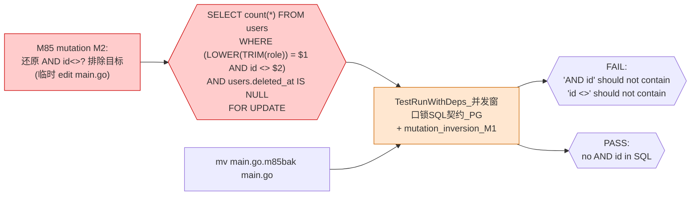
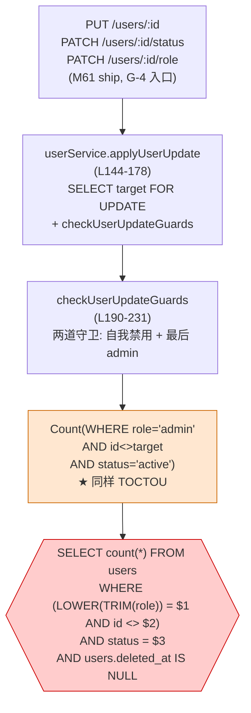
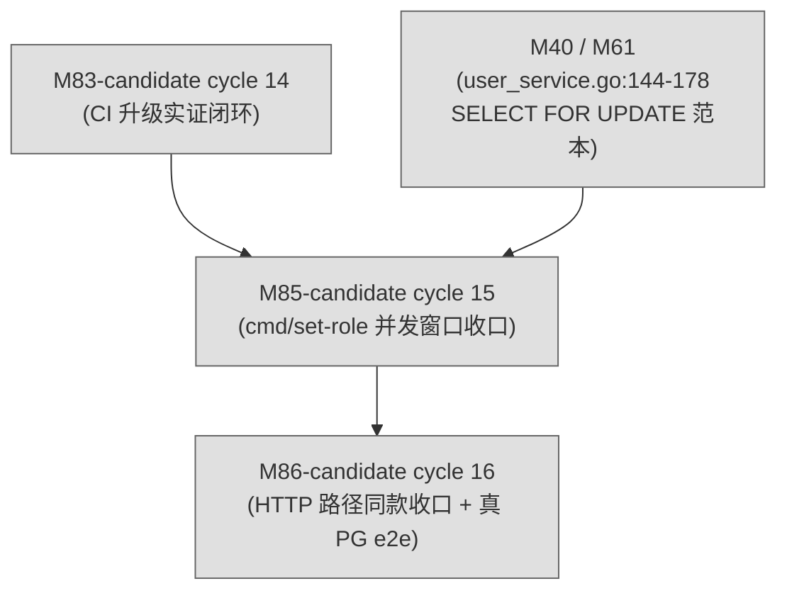

# M85-candidate Graph Analysis — `cmd/set-role` 并发窗口 mutation inversion 调用链

> **Round**: M85-candidate (OMH ulw-loop 第 15 cycle, 2026-09-16)
> **Intent**: `intent-M85-candidate.md`
> **Completion**: `M85-candidate-completion-report.md`
> **Layout**: cmd/set-role 节点图 + mutation inversion 调用链 (M1/M2) + M82↔M83↔M85 范本对比 + HTTP 路径同款问题地图

## 1. cmd/set-role 并发窗口收口节点图 (`backend/cmd/set-role/main.go`)

```mermaid
graph TD
  Env["env: SET_ROLE_USERNAME<br/>SET_ROLE_ROLE"]
  ParseEnv["parseSetRoleEnv<br/>(L141-152)<br/>trim + 校验非空"]
  LoadDB["database.Init<br/>(L37-63 run)<br/>注入 MigrationsFS"]
  RunWithDeps["runWithDeps<br/>(L67-125)<br/>主流程"]

  subgraph 防自锁守卫["防自锁守卫 (M85 收口重点)"]
    Tx["db.Transaction"]
    CheckRole["if canonical!=admin<br/>&& current==admin"]
    CountAdmin["countAdminUnderLock<br/>(L133-140)<br/>broad lock + totalAdmins"]
    LockCheck{{"totalAdmins <= 1?<br/>→ 拒绝"}}
  end

  subgraph 写入["写入 users.role + user_roles"]
    UpdateRole["tx.Model(users).<br/>Where(id=?).<br/>Update(role, canonical)"]
    SyncUserRoles["syncUserRoles<br/>(L142-165)<br/>DELETE old + INSERT new"]
  end

  Result{{"log: ✅ 用户 X 角色 A → B<br/>或<br/>log.Fatalf: 拒绝执行"}}

  Env --> ParseEnv --> LoadDB --> RunWithDeps
  RunWithDeps --> Tx
  Tx --> CheckRole
  CheckRole -->|是| CountAdmin
  CountAdmin -->|totalAdmins<=1| LockCheck
  LockCheck -->|"唯一管理员"| Result
  CountAdmin -->|totalAdmins>1| UpdateRole
  CheckRole -->|否 (current!=admin)| UpdateRole
  UpdateRole --> SyncUserRoles --> Result

  classDef gate fill:#ffe7d0,stroke:#cc6600;
  class CountAdmin gate;
  classDef mutation fill:#ffcccc,stroke:#cc0000;
  class LockCheck mutation;
```

★ M85 mutation inversion 实证目标: `CountAdmin` 的 SQL 形态 (必须含 `FOR UPDATE` 且不含 `AND id`).

## 2. countAdminUnderLock SQL 形态 (`PG dialector + DryRun`)

```mermaid
graph LR
  MutFile["backend/cmd/set-role/main.go<br/>(M85 fix)"]
  Helper["countAdminUnderLock<br/>(L133-140)"]
  Chain["Model(users).<br/>Clauses(clause.Locking{Strength:\"UPDATE\"}).<br/>Where(LOWER(TRIM(role))=admin)"]
  DryRun["GORM Session{DryRun: true}<br/>(白盒测试)"]
  PG["postgres.New<br/>(PG dialector)"]
  SQL{{"SELECT count(*) FROM users<br/>WHERE LOWER(TRIM(role)) = $1<br/>AND users.deleted_at IS NULL<br/>FOR UPDATE"}}

  MutFile --> Helper --> Chain
  Chain -.绑定.-> DryRun
  DryRun --> PG
  Chain --> SQL
  PG --> SQL

  classDef mutation fill:#ffcccc,stroke:#cc0000;
  class MutFile,Chain mutation;
  classDef gate fill:#ffe7d0,stroke:#cc6600;
  class DryRun,SQL gate;
```

**关键 SQL 断言** (白盒契约测试):
- `assert.Contains(sqlText, "FOR UPDATE")` — PG 渲染了锁, 不锁就 TOCTOU
- `assert.NotContains(sqlText, "AND id")` — 没排除目标, 排除会让两个并发 demote 锁集合不相交

## 3. M1 mutation inversion 调用链 — 「剥 clause.Locking 真无锁」`

```mermaid
graph LR
  Mut["M85 mutation M1:<br/>剥 Clauses(clause.Locking{Strength:\"UPDATE\"})<br/>(临时 edit main.go, 实证完 mv 还原)"]
  SQLNoLock{{"SELECT count(*) FROM users<br/>WHERE LOWER(TRIM(role)) = $1<br/>AND users.deleted_at IS NULL<br/>(NO FOR UPDATE)"}}
  ContractTest["TestRunWithDeps_并发窗口锁SQL契约_PG<br/>+ mutation_inversion_M1"]
  RedExpect{{"FAIL:<br/>'FOR UPDATE' does not contain"}}
  Restore["mv main.go.m85bak main.go"]
  GreenExpect{{"PASS:<br/>FOR UPDATE in SQL"}}

  Mut --> SQLNoLock
  SQLNoLock --> ContractTest
  ContractTest --> RedExpect
  Restore --> ContractTest
  ContractTest --> GreenExpect

  classDef mutation fill:#ffcccc,stroke:#cc0000;
  class Mut,SQLNoLock mutation;
  classDef gate fill:#ffe7d0,stroke:#cc6600;
  class ContractTest gate;
```

**链语义**: mutation 剥锁 → SQL 不带 FOR UPDATE → 白盒契约测试红 → 还原 main.go → SQL 带 FOR UPDATE → 测试绿.

**实证原文** (见 M85-completion-report §3.1):
```
$ cd backend && go test -race -count=1 -v -run 'TestRunWithDeps_并发窗口锁SQL契约_PG|TestRunWithDeps_并发窗口mutation_inversion_M1' ./cmd/set-role/
--- FAIL: TestRunWithDeps_并发窗口锁SQL契约_PG
    Error: "SELECT count(*) FROM \"users\" WHERE LOWER(TRIM(role)) = $1 AND \"users\".\"deleted_at\" IS NULL" does not contain "FOR UPDATE"
--- FAIL: TestRunWithDeps_并发窗口mutation_inversion_M1
    Error: "SELECT count(*) FROM \"users\" WHERE LOWER(TRIM(role)) = $1 AND \"users\".\"deleted_at\" IS NULL" does not contain "FOR UPDATE"

$ mv main.go.m85bak main.go  # 还原
$ cd backend && go test -race -count=1 -run 'TestRunWithDeps_并发窗口' ./cmd/set-role/
PASS
ok  	network-monitor-platform/cmd/set-role	1.059s
```

## 4. M2 mutation inversion 调用链 — 「排除目标真让锁集合不相交」



**链语义**: mutation 还原 AND id<>? → SQL 带 AND id <> (即便有 broad lock) → 白盒契约测试红 → 还原 main.go → SQL 无 AND id → 测试绿.

**实证原文** (见 M85-completion-report §3.2):
```
$ cd backend && go test -race -count=1 -v -run 'TestRunWithDeps_并发窗口锁SQL契约_PG|TestRunWithDeps_并发窗口mutation_inversion_M1' ./cmd/set-role/
--- FAIL: TestRunWithDeps_并发窗口锁SQL契约_PG
    Error: "...WHERE (LOWER(TRIM(role)) = $1 AND id <> $2) AND..." should not contain "AND id"
    Error: "..."should not contain "id <>"
--- FAIL: TestRunWithDeps_并发窗口mutation_inversion_M1
    Error: "..."should not contain "AND id"

$ mv main.go.m85bak main.go  # 还原
$ cd backend && go test -race -count=1 -run 'TestRunWithDeps_并发窗口' ./cmd/set-role/
PASS
ok  	network-monitor-platform/cmd/set-role	1.043s
```

## 5. 业务并发窗口 真修复 vs 「半截修复」 对比

| 维度 | 旧代码 (M85 修前) | mutation M2 (半截修复) | **M85 新代码 (全修复)** |
|---|---|---|---|
| `clause.Locking{Strength: "UPDATE"}` | ❌ 无 | ✅ 有 (broad lock) | ✅ 有 (broad lock) |
| `WHERE role='admin' AND id<>target` | ✅ 是 (排除目标) | ✅ 是 (排除目标) | ❌ 否 (锁全部 admin) |
| SQL 锁集合 (2 个并发 demote A + B) | - | {B} + {A} = 不相交 | {A, B} + {A, B} = 相交 |
| PG 行为 | **race window: 各自看 count others=1, 双双通过, 0 admin** | **同旧代码, broad lock 救不了** | **串行: Tx B 等 Tx A commit 后 count=1, 拒绝** |
| 白盒测试结果 | 锁无 SQL → 红 | 锁在 SQL 但有 AND id → 红 | 全绿 |

**关键设计要点**: 「半截修复」(M2) 看起来对了 — 加了 FOR UPDATE — 但「排除目标」让两个并发 demote-admin 锁不到共同行, **TOCTOU 重启**. M85 的白盒 SQL 契约测试钉死这一点, 不允许"修了半截".

## 6. HTTP 路径同款问题地图 (`internal/service/user_service.go`)



★ HTTP 路径 user_service.go:215-228 `checkUserUpdateGuards` 同样有 broad-lock-vs-exclude-target 设计错误. count "WHERE role='admin' AND id<>target AND status='active'" 排除目标, 同样 TOCTOU. **M86+ candidate 候选**.

## 7. Cross-cutting 依赖图



**前置**:
- M83-candidate cycle 14 已 ship (`35dc9d6`), PM_QUEUE state fixup 是 M85 必要前置 (沿用 M79 D2 自旋防)
- `internal/service/user_service.go:144-178` 已 ship 的 SELECT FOR UPDATE 范本是 M85 修复的对齐基线

**后续**:
- M86+ candidate = HTTP 路径 user_service.go 同款 TOCTOU 收口 (加 service 包 mutation 反证测试 + 真 PG e2e 测试)

## 8. M82 ↔ M83 ↔ M85 mutation inversion 范本对比

| 维度 | M82-candidate (cycle 13) | M83-candidate (cycle 14) | **M85-candidate (cycle 15)** |
|---|---|---|---|
| **守卫对象** | 业务代码 (`writeNotificationTrigger`) | CI 守门 (`go test -race` + `npx vitest run`) | **业务并发窗口 (cmd/set-role count)** |
| **mutation 类型** | 删 rule filter (业务行为突变) | 故意 race / 故意 fail (CI 守门输入) | **剥 clause.Locking / 还原 AND id<>?** |
| **反证方式** | sqlmock 序列 + 真 sqlite count | race detector stack trace + vitest assertion error | **PG dialector + DryRun 抓 SQL 包含 FOR UPDATE** |
| **期望红** | `TestWriteNotificationTrigger_RuleEmpty_NoLogs` 红 | `WARNING: DATA RACE` + `AssertionError` | **`"FOR UPDATE" does not contain` / `"AND id" should not contain`** |
| **期望还原绿** | helper + rule filter 守卫 | 删除 mutation 文件 | **还原 main.go (mv main.go.m85bak main.go)** |
| **关键设计要点** | 「反向断言用真 sqlite」 | 「CI 守门真等价于 mutation 实证」 | **「SQL 契约钉住锁集合 + 排除目标」** |
| **范本编号** | **范本 A** (业务代码 mutation) | **范本 B** (CI 守门 mutation) | **范本 C** (业务并发窗口 mutation) [NEW] |

三条 mutation inversion 范本可写进 `~/.omh/skills/planner/intent-spec-author/SKILL.md` 8 节 Verification 段的范本库, 后续 round 复用.

## 9. mutation inversion 范本 → skill library 候选

`~/.omh/skills/planner/intent-spec-author/SKILL.md` 8 节 Verification 段可新增范本:

```markdown
### 范本 A: 业务代码 mutation inversion (M82 范本)
- 删/改业务守卫 (filter / helper / check)
- sqlmock + 真 DB (sqlite) 双层守卫
- 反向断言 (期望 INSERT **不**发生) 必须用真 DB

### 范本 B: CI 守门 mutation inversion (M83 范本) [NEW]
- 写故意失败测试 (race / assertion fail) 临时文件
- 跑 CI 同命令 (`go test -race` / `npx vitest run`)
- 期望红 (race detector / vitest exit code 非 0)
- 删除临时文件, 控制 (control) 重跑同命令, 期望还原绿
- 临时文件**不入 commit** (git stash 或 /tmp/ + cp)

### 范本 C: 业务并发窗口 mutation inversion (M85 范本) [NEW]
- 业务代码路径上的并发守卫 (count-then-write, SELECT FOR UPDATE 等)
- mutation 类型: 剥锁子句 / 还原排除目标 / 改并发集合
- 反证方式: PG dialector + DryRun 抓 SQL 形态, 断言关键子句 (FOR UPDATE / 排除目标 NOT 出现)
- 期望红: 关键 SQL 子句不匹配断言
- 期望还原绿: SQL 子句匹配, 控制 (control) 重跑测试
- 临时文件**不入 commit** (用 `*.m85bak` 同目录备份, 实证完 mv 还原 + rm)
- 注意: sqlite 单连接天然串行, 抓不到真并发 race — 范本 C 抓**设计正确性** (锁集合), 不抓**真并发行为** (后者需要真 PG e2e)
```

## 10. 引用

- `intent-M85-candidate.md` — 8 节 omh-plan 骨架
- `M85-candidate-completion-report.md` — 实证 + mutation inversion + commit 序列 + 派生 TODO
- `backend/cmd/set-role/main.go` — 修复点 (countAdminUnderLock helper, broad lock)
- `backend/cmd/set-role/main_test.go` — 4 新测试 (锁SQL契约_PG + sqlite对照 + mutation_inversion_M1 + GORM并发等价)
- `internal/service/user_service.go:144-178` — 既有 SELECT FOR UPDATE 范本基线
- `IntentSpec Author skill` — `~/.omh/skills/planner/intent-spec-author/SKILL.md`
- M82 cycle 13 closeout — `~/.hermes/state/PM_LAST_DISPATCH_RESULT.md` 范本
- M83 cycle 14 closeout — `~/.hermes/state/PM_LAST_DISPATCH_RESULT.md` 范本
- M84 cycle 13 ship — `e2937dd` watchdog 自举