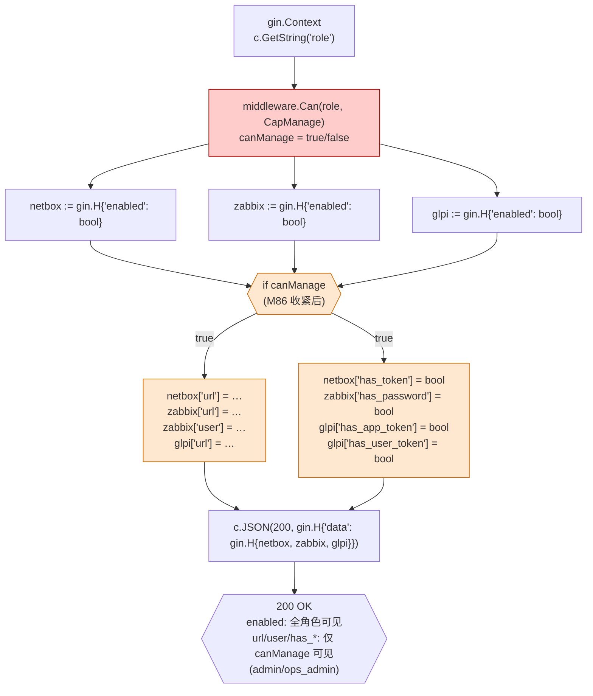
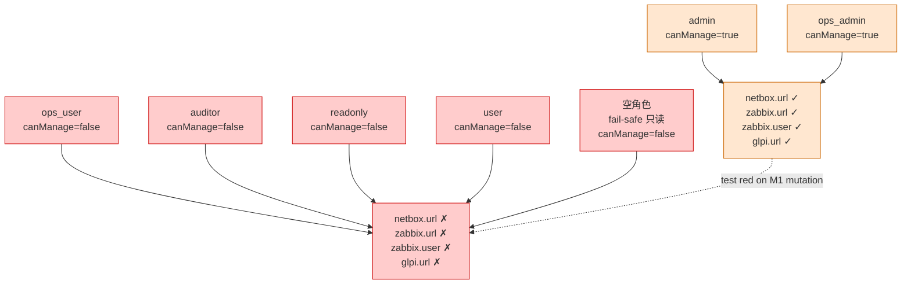
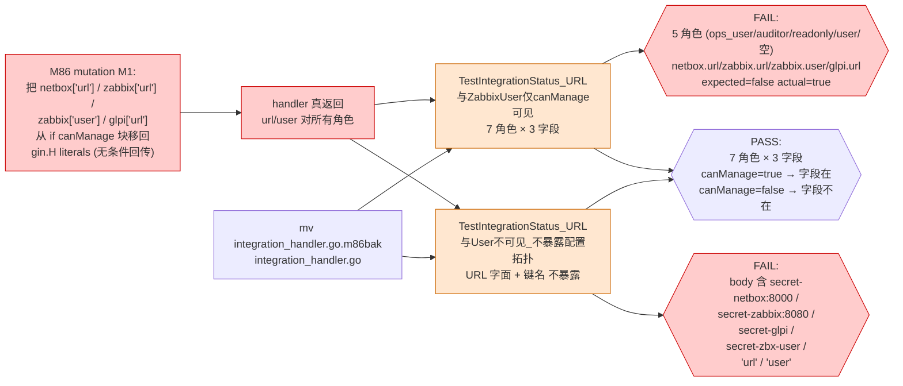
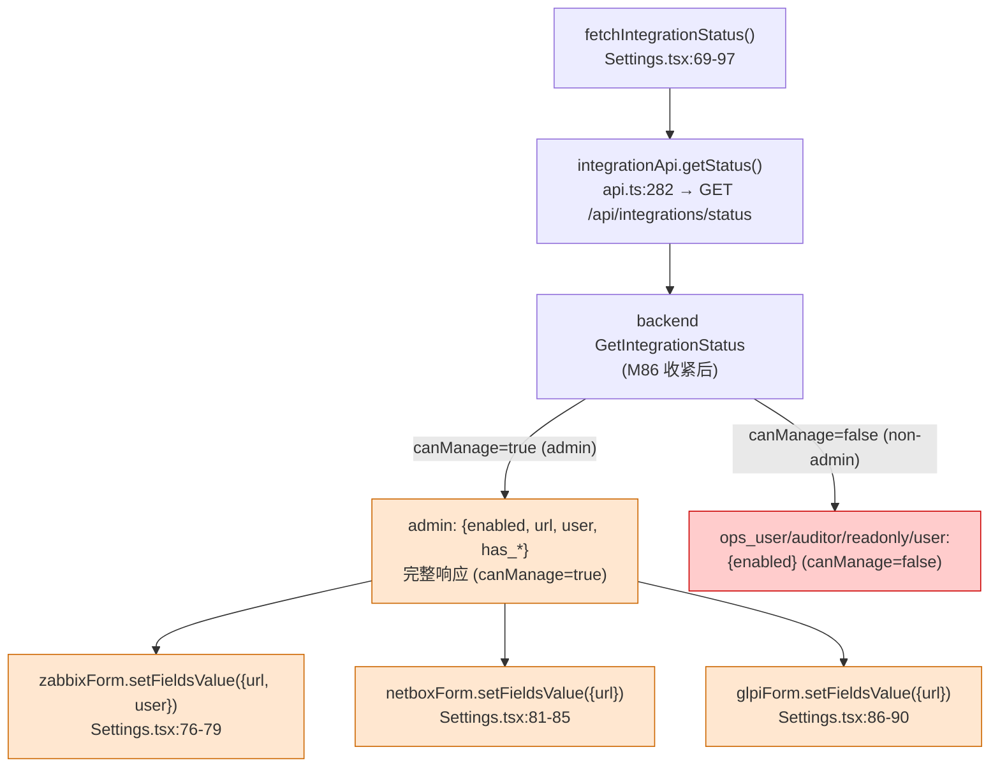
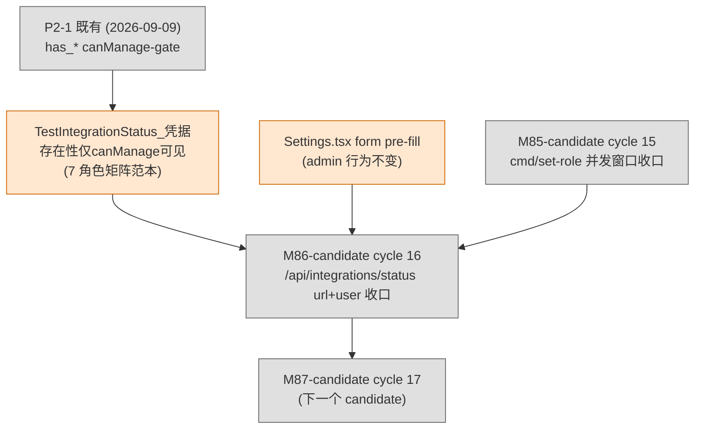

# M86-candidate Graph Analysis — `GET /api/integrations/status` url/user canManage-gate mutation inversion 调用链

> **Round**: M86-candidate (OMH ulw-loop 第 16 cycle, 2026-09-16)
> **Intent**: `intent-M86-candidate.md`
> **Completion**: `M86-candidate-completion-report.md`
> **Layout**: GetIntegrationStatus handler 节点图 + 7-角色矩阵节点图 + mutation inversion 调用链 (M1) + P2-1↔M86 范本对比 + M82↔M83↔M85↔M86 范本对比 + Settings form pre-fill 节点图

## 1. GetIntegrationStatus handler 收紧前后节点图 (`backend/internal/api/handlers/integration_handler.go`)



★ M86 mutation inversion 实证目标: `IfCM` 守卫 — `canManage=true` 时 4 字段 (netbox.url / zabbix.url / zabbix.user / glpi.url) + 4 has_* 才挂上; `canManage=false` 时只挂 `enabled`.

## 2. 7-角色矩阵节点图 (`TestIntegrationStatus_URL与ZabbixUser仅canManage可见`)



★ M86 mutation 反证: 5 个非 canManage 角色 (ops_user/auditor/readonly/user/空) 在 M1 mutation 后看到 `url`/`user` → 7-角色矩阵测试红 + URL 字面暴露测试红.

## 3. M1 mutation inversion 调用链 — 「canManage 守卫真在门」



**链语义**: mutation 把 url/user 移回 gin.H literals → handler 对所有角色返回 url/user → 7-角色矩阵 5 角色看到字段 (expected=false actual=true) 红 + URL 字面暴露测试 6 断言全红 → 还原 handler → 7-角色矩阵全绿 + URL 字面暴露测试全绿.

**实证原文** (见 M86-completion-report §3.1):
```
$ cd backend && go test -race -count=1 -v -run 'TestIntegrationStatus_URL与ZabbixUser仅canManage可见|TestIntegrationStatus_URL与User不可见_不暴露配置拓扑' ./internal/api/handlers/
--- FAIL: TestIntegrationStatus_URL与ZabbixUser仅canManage可见 (0.00s)
    --- PASS: .../admin (0.00s)                  ← canManage=true 仍绿 (mutation 不影响)
    --- PASS: .../ops_admin (0.00s)               ← canManage=true 仍绿
    --- FAIL: .../ops_user (0.00s)                ← canManage=false 现在看到 url/user (FAIL)
    --- FAIL: .../auditor (0.00s)                 ← 同上
    --- FAIL: .../readonly (0.00s)                ← 同上
    --- FAIL: .../user (0.00s)                     ← 同上
    --- FAIL: .../#00 (0.01s)                     ← 空角色 fail-safe (FAIL)
--- FAIL: TestIntegrationStatus_URL与User不可见_不暴露配置拓扑 (0.00s)

$ mv backend/internal/api/handlers/integration_handler.go.m86bak backend/internal/api/handlers/integration_handler.go  # 还原
$ cd backend && go test -race -count=1 -run 'TestIntegrationStatus_URL与ZabbixUser仅canManage可见|TestIntegrationStatus_URL与User不可见_不暴露配置拓扑' ./internal/api/handlers/
PASS
ok  	network-monitor-platform/internal/api/handlers	1.097s
```

## 4. P2-1 ↔ M86 范本对比 — 同款分级, 扩展覆盖

| 维度 | P2-1 既有 (`has_*` canManage-gate) | **M86 扩展 (`url`/`user` canManage-gate)** |
|---|---|---|
| **守卫字段** | `netbox.has_token` / `zabbix.has_password` / `glpi.has_app_token` / `glpi.has_user_token` | **`netbox.url` / `zabbix.url` / `zabbix.user` / `glpi.url`** |
| **守卫代码** | `if canManage { ... has_* = ... }` (已有) | `if canManage { ... url/user = ... }` (M86 加入) |
| **测试** | `TestIntegrationStatus_凭据存在性仅canManage可见` (7 角色 × 4 has_*) | **`TestIntegrationStatus_URL与ZabbixUser仅canManage可见`** (7 角色 × 3 url/user) + **`TestIntegrationStatus_URL与User不可见_不暴露配置拓扑`** (URL 字面不暴露) |
| **设计要点** | P2-1 fix: 凭据存在性 (true/false 布尔) 限 canManage | **M86 扩展: 配置详情 (URL 拓扑 + Zabbix 用户名) 限 canManage** |
| **泄露面** | "凭据是否已配置" (boolean 旁路泄露) | **"集成 URL 拓扑" + "Zabbix 用户名" (内网拓扑信息 + 凭据用户名)** |
| **范本编号** | **P2-1 既有** (无 mutation 反证) | **M86 mutation 范本 D (响应字段守卫 mutation)** |
| **OpenAPI** | `IntegrationStatus` schema 注释 "has_* 仅 canManage 返回" (P2-1 ship) | **`IntegrationStatus` schema description 按能力分级描述** (M86 ship) |

**关键设计要点**: M86 沿用 P2-1 同款「`if canManage` 守卫 + 7 角色矩阵测试」结构, 不引入新设计. 只是把守卫从「凭据存在性字段」扩展到「配置详情字段」 — 因为内网 URL 拓扑 + Zabbix 用户名同样属敏感信息, 同样按能力分级.

## 5. M82 ↔ M83 ↔ M85 ↔ M86 mutation inversion 范本对比

| 维度 | M82-candidate (cycle 13) | M83-candidate (cycle 14) | M85-candidate (cycle 15) | **M86-candidate (cycle 16)** |
|---|---|---|---|---|
| **守卫对象** | 业务代码 (`writeNotificationTrigger` rule filter) | CI 守门 (`go test -race` + `npx vitest run`) | 业务并发窗口 (cmd/set-role count) | **响应字段守卫 (`/integrations/status` url/user)** |
| **mutation 类型** | 删 rule filter (业务行为突变) | 故意 race / 故意 fail (CI 守门输入) | 剥 clause.Locking / 还原 AND id<>? | **移回 url/user 到 gin.H literals (回归无条件回传)** |
| **反证方式** | sqlmock 序列 + 真 sqlite count | race detector stack trace + vitest assertion error | PG dialector + DryRun 抓 SQL 包含 FOR UPDATE | **7-角色矩阵 + URL 字面不暴露** (handler 黑盒断言) |
| **期望红** | `TestWriteNotificationTrigger_RuleEmpty_NoLogs` 红 | `WARNING: DATA RACE` + `AssertionError` | `"FOR UPDATE" does not contain` / `"AND id" should not contain` | **`netbox.url should not exist (5 角色)` + `body should not contain "secret-netbox:8000"`** |
| **期望还原绿** | helper + rule filter 守卫 | 删除 mutation 文件 | 还原 main.go (mv main.go.m85bak main.go) | **还原 handler (mv integration_handler.go.m86bak integration_handler.go)** |
| **关键设计要点** | 「反向断言用真 sqlite」 | 「CI 守门真等价于 mutation 实证」 | 「SQL 契约钉住锁集合 + 排除目标」 | **「7 角色矩阵钉住 canManage 分级 + URL 字面不暴露防脱敏绕过」** |
| **mutation 工具** | 直接改业务代码 (sed) | 临时文件 (m83_race_test.go + m83_failing.test.ts) | sed + bak 文件 (M85 范本 C) | **Python 脚本 + bak 文件 (M86 范本 D)** |
| **范本编号** | **范本 A** (业务代码 mutation) | **范本 B** (CI 守门 mutation) | **范本 C** (业务并发窗口 mutation) | **范本 D** (响应字段守卫 mutation) [NEW] |

四条 mutation inversion 范本可写进 `~/.omh/skills/planner/intent-spec-author/SKILL.md` 8 节 Verification 段的范本库, 后续 round 复用.

## 6. Settings form pre-fill 节点图 (frontend form pre-fill 行为不变)



★ admin 角色 (Settings 实际使用者) 的 form pre-fill 行为**完全不变** — `data.zabbix.url` / `user` / `data.netbox.url` / `data.glpi.url` 都在 admin 响应里. M86 收紧只影响 non-admin 角色, 而 non-admin 即使打开 Settings 也只能 pre-fill 空白 (因为 backend 不返回 url/user).

## 7. Cross-cutting 依赖图



**前置**:
- P2-1 既有 (2026-09-09) `has_*` canManage-gate + 7-角色矩阵测试范本是 M86 沿用的基础
- M85 cycle 15 ship (cmd/set-role 并发窗口收口) 派工 PM_QUEUE 下一个 candidate = M86 (PM_QUEUE 派生沿用)
- Settings.tsx form pre-fill 行为 admin 不变是 M86 不动 frontend 的依据

**后续**:
- M87+ candidate = next PM_QUEUE derived item (TODO.md 派生沿用)
- 沿用 M86 范本 D (响应字段守卫 mutation) 可低成本收口其他响应字段分级 (例: HTTP 路径 user_service.go 的 count "其他 admin" 同款收紧)

## 8. mutation inversion 范本 → skill library 候选

`~/.omh/skills/planner/intent-spec-author/SKILL.md` 8 节 Verification 段可新增范本:

```markdown
### 范本 A: 业务代码 mutation inversion (M82 范本)
- 删/改业务守卫 (filter / helper / check)
- sqlmock + 真 DB (sqlite) 双层守卫
- 反向断言 (期望 INSERT **不**发生) 必须用真 DB

### 范本 B: CI 守门 mutation inversion (M83 范本) [NEW]
- 写故意失败测试 (race / assertion fail) 临时文件
- 跑 CI 同命令 (`go test -race` / `npx vitest run`)
- 期望红 (race detector / vitest exit code 非 0)
- 删除临时文件, 控制 (control) 重跑同命令, 期望还原绿
- 临时文件**不入 commit** (git stash 或 /tmp/ + cp)

### 范本 C: 业务并发窗口 mutation inversion (M85 范本) [NEW]
- 业务代码路径上的并发守卫 (count-then-write, SELECT FOR UPDATE 等)
- mutation 类型: 剥锁子句 / 还原排除目标 / 改并发集合
- 反证方式: PG dialector + DryRun 抓 SQL 形态, 断言关键子句 (FOR UPDATE / 排除目标 NOT 出现)
- 期望红: 关键 SQL 子句不匹配断言
- 期望还原绿: SQL 子句匹配, 控制 (control) 重跑测试
- 临时文件**不入 commit** (用 `*.m85bak` 同目录备份, 实证完 mv 还原 + rm)
- 注意: sqlite 单连接天然串行, 抓不到真并发 race — 范本 C 抓**设计正确性** (锁集合), 不抓**真并发行为** (后者需要真 PG e2e)

### 范本 D: 响应字段守卫 mutation inversion (M86 范本) [NEW]
- 业务代码路径上的响应字段守卫 (`if canManage` / `if canAudit` / capability-gate)
- mutation 类型: 把字段移出守卫块 (回归无条件回传) / 改守卫判据 / 删守卫块
- 反证方式: 7-角色矩阵 + URL 字面不暴露 (handler 黑盒断言 body 字面)
- 期望红: 5 非-守卫 角色看到字段 (expected=不存在, actual=存在) + body 含敏感字面
- 期望还原绿: 守卫在门 → 字段按角色分级, 控制 (control) 重跑测试
- 临时文件**不入 commit** (用 `*.m86bak` 同目录备份, 实证完 mv 还原 + rm)
- 工具选择: Python 脚本 (精确字符串 replace, 0 转义问题) > sed (双步修改易失败, 范本 C 用过)
- 既有测试更新: 收紧即收测试角色 — 既有断言 url 可见的测试必须改用守卫角色 (admin / ops_admin), 与 P2-1 fix 既有测试不动 (P2-1 是新增分级) 区分
```

## 9. 引用

- `intent-M86-candidate.md` — 8 节 omh-plan 骨架
- `M86-candidate-completion-report.md` — 实证 + mutation inversion + commit 序列 + 派生 TODO
- `backend/internal/api/handlers/integration_handler.go` — 修复点 (`if canManage` 守卫 url/user, +29/-7)
- `backend/internal/api/handlers/integration_handler_test.go` — 2 新测试 (7 角色矩阵 + URL 字面不暴露) + 既有 2 测试更新 (ThreeIntegrationsReturnURL 改 admin + 凭据存在性测试注释), +90/-16
- `backend/internal/api/openapi.yaml` — `/integrations/status` description + `IntegrationStatus` schema description + `required` 字段, +9/-8
- `backend/internal/api/routes.go` — 注释 "只读 status 也分级 — 仅 canManage 看 url / Zabbix user (M86 收紧)", +3/-2
- `backend/internal/api/routes_integration_test.go` — route map 描述, +1/-1
- `frontend/src/pages/Settings.tsx:69-90` — fetchIntegrationStatus form pre-fill (admin 行为不变)
- P2-1 既有 (2026-09-09) `has_*` canManage-gate 范本 — `integration_handler_test.go:147-198`
- `IntentSpec Author skill` — `~/.omh/skills/planner/intent-spec-author/SKILL.md`
- M82 cycle 13 closeout — `~/.hermes/state/PM_LAST_DISPATCH_RESULT.md` 范本
- M83 cycle 14 closeout — `~/.hermes/state/PM_LAST_DISPATCH_RESULT.md` 范本
- M85 cycle 15 closeout — `~/.hermes/state/PM_LAST_DISPATCH_RESULT.md` 范本
- M84 cycle 13 ship — `e2937dd` watchdog 自举