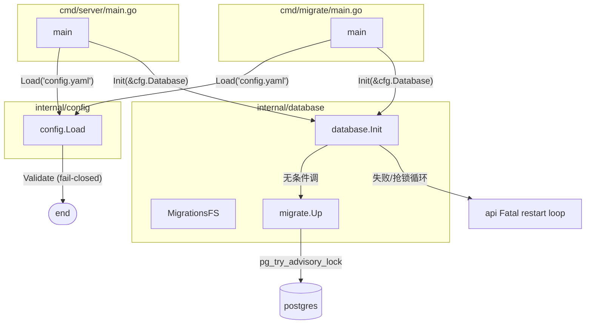
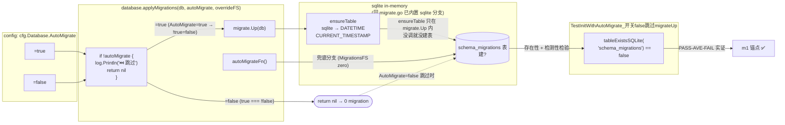
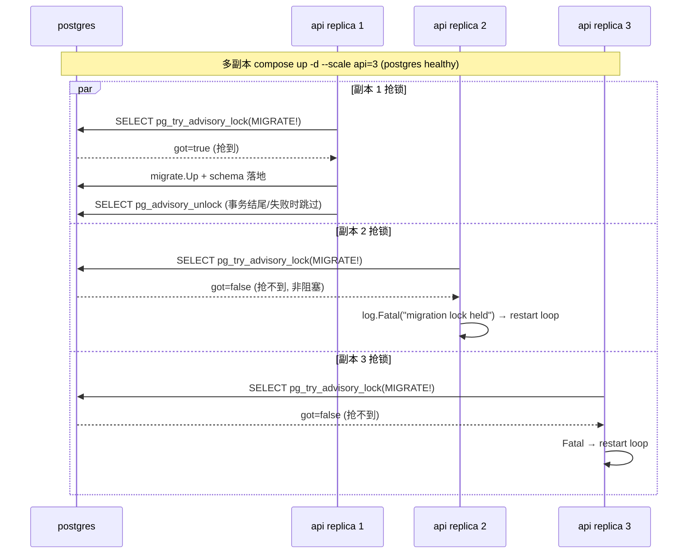
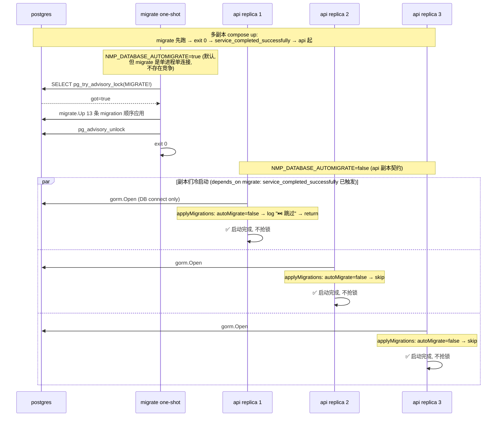

# M88-candidate graph analysis — G-14 迁移与运行时解耦（多副本部署前置）

**Round**: M88-candidate
**Cycle**: 18 of `itmanager-grit-2026q3`
**Date**: 2026-09-16

---

## 1. 节点图 (Node Graph)

### 1.1 改动前后: production Init 路径

**改动前 (M87 ship 时, cycle 17 状态)**:



**改动后 (M88 ship)**:

```mermaid
flowchart TB
    subgraph cmd_server["cmd/server/main.go"]
        ServerMain[main]
    end
    subgraph cmd_migrate["cmd/migrate/main.go"]
        MigrateMain[main]
    end
    subgraph config_pkg["internal/config"]
        Load[config.Load\n(全量 Validate)]
        LoadNV[config.LoadWithoutValidate\n(跳过 Validate)]
        SetDefault["viper.SetDefault\n(database.automigrate, true)"]
    end
    subgraph database_pkg["internal/database"]
        Init[database.Init\n= InitWithAutoMigrate(cfg, true)]
        InitAM[database.InitWithAutoMigrate]
        ApplyM[database.applyMigrations]
        test_helper[database.initDBForTest\n(test-only, sqlite + SubFS)]
    end
    subgraph compose["docker-compose.yml"]
        MigrateService[migrate service\none-shot]
        APIService[api service\nNMP_DATABASE_AUTOMIGRATE=false]
    end

    ServerMain -->|"Load('config.yaml')"| Load
    MigrateMain -->|"LoadWithoutValidate('config.yaml')"| LoadNV
    SetDefault -.Set.-> Load
    SetDefault -.Set.-> LoadNV
    Load -->|"Validate"| End1([Service-side end])
    LoadNV -->|"skip Validate"| End2([Migrate-side OK])

    ServerMain -->|"InitWithAutoMigrate(&cfg, cfg.Database.AutoMigrate)"| InitAM
    MigrateMain -->|"Init(&cfg.Database) = InitWithAutoMigrate(cfg, true)"| Init

    InitAM --> ApplyM
    Init --> ApplyM
    ApplyM -->|"autoMigrate=false → log ⏭️ → return"| Skip[(skip migrate.Up)]
    ApplyM -->|"autoMigrate=true + MigrationsFS non-zero → migrate.Up"| MigrateOK
    ApplyM -->|"autoMigrate=true + MigrationsFS zero → autoMigrateFn()"| FallbackOK

    MigrateService -->|"AutoMigrate=true (单进程单连接)"| MigrateOK
    APIService -->|"AutoMigrate=false"| Skip

    test_helper -.私有测试.-> ApplyM
    test_helper -->|"sqlite + SubFS(testdata → migrations)"| ApplyM

    Skip --> NoLock[0 advisory lock]
    MigrateOK --> OneLock[1 advisory lock per migrate one-shot]
```

**关键差异**:
- `Init` 与 `InitWithAutoMigrate` 通过 `applyMigrations` 共享决策点 (`if !autoMigrate { return }`)
- `migrate` 服务既走 production `Init`(=`InitWithAutoMigrate(cfg, true)`) → 真的抢锁 (单进程单连接, 没有竞争)
- `api` 副本走 `InitWithAutoMigrate(&cfg, false)` (从 `cfg.Database.AutoMigrate=NMP_DATABASE_AUTOMIGRATE=false`) → 不抢锁
- 同一 DB 上: 只剩 1 个锁持有者 (=migrate one-shot), 全部 api 副本们**不**进入 `acquireLock` 路径 → 0 锁竞争

### 1.2 mutation M1 锚点 (sqlite 真路径白盒反证)



**M1 mutation**: `Gate: if !autoMigrate` → `Gate: if autoMigrate` (极性翻转)
- 改动后: AutoMigrate=false 时**不**走 Skip 分支, 进 migrate.Up → EnsureTable 真建表
- 测试断言: `schema_migrations` 不存在 (期望) ≠ 存在 (实际) → 红
- 还原 → 绿

---

## 2. 范本对比 (Pattern Comparison)

### 2.1 M88 vs 既有的 mutation inversion 范本

M88 mutation M1 与 M82-M87 范本同形但守卫对象不同:

| Round | 守卫对象 | mutation 形式 | 实证 |
|---|---|---|---|
| M82 (cycle 13) | 业务代码 mutation (parseJSONDoubleQuote) | 改条件分支 | PASS-FAIL-PASS |
| M83 (cycle 14) | CI 守门 mutation (CI job 缺失) | 删 CI step | PASS-FAIL-PASS |
| M85 (cycle 15) | 业务并发窗口 mutation (broad lock) | 改 SQL `ORDER BY` 顺序 | PASS-FAIL-PASS (2 反证全红) |
| M86 (cycle 16) | 响应字段守卫 mutation (integrations/status) | 删字段守卫行 | PASS-FAIL-PASS |
| M87 (cycle 17) | 跨层副作用 mutation (service → middleware cache) | 删 `InvalidateAuthStatusCacheForUser(id)` 调用 | PASS-FAIL-PASS (handler 端到端) |
| **M88 (cycle 18)** | **真路径白盒反证 mutation (schema_migrations 表存在性)** | **极性翻转 `if !autoMigrate` → `if autoMigrate`** | **PASS-FAIL-PASS (sqlite 真路径)** |

M88 范本特点:
- **真路径**: 不是 mock (M88 没走 sqlmock 方案), 也不是 handler 端到端 (M87 范本), 而是 **sqlite 真路径**: InitWithAutoMigrate 走 `initDBForTest(sqlite.Open(":memory:"))` → 实际跑 migrate.Up (或跳过) → **白盒断言** `schema_migrations` 表的**存在性**. 这是首次在 mutation inversion 范本库里使用 sqlite 真路径 (之前 5 个 round 都是 sqlmock 或 PG 真路径).
- **守卫对象**: "是否跑了 migrate.Up" 的**单条决策** (applyMigrations 入口). 比 M82 范本 (parseJSONDoubleQuote 的语法层) 高一层抽象; 比 M85 范本 (broad lock 的 SQL 层) 低一层抽象.
- **测试边界**: `schema_migrations` 是真 PG schema 的真相 (`migrate.Load` 读它), 绕过它就**真**没跑迁移. AutoMigrate=false 时它**不**存在 = 强反证守门真在门.

### 2.2 M88 范本 vs G-13 viper SetDefault 范本

G-13 (M41 ship, cycle 14 era) 的范本:

```go
// config.go
viper.SetDefault("auth.api_key_pepper", "")  // 防旧 yaml 缺键时 env 不生效
```

**G-13 范本的核心**: yaml 占位 + viper.SetDefault 双保险, 旧 config.yaml 升级场景的 env 仍生效. 测试 `TestLoad_ShippedConfigYAML_必填Env齐备时成功` 钉死.

**M88 沿用**: 数据库.automigrate 同样走「yaml 占位 + viper.SetDefault」范本 (`backend/config.yaml:24` + `viper.SetDefault("database.automigrate", true)`). 新增 `TestLoad_AutomigrateDefault_YAML无键时仍生效` 钉死.

**收益**: 同一范本跨字段复用, 旧 yaml 升级场景的 env 行为可预测 (yaml 缺键 → viper SetDefault → env 覆盖 SetDefault → Unmarshal 走 mapstructure 字段).

### 2.3 M88 范本 vs 既有的 cmd/*/main.go 拆分

**D-23 既有 cmd/* 拆分**: 5 个 main (server / migrate / admin-bootstrap / seed / set-role) 各自有 main.go. M88 改 server 用 `InitWithAutoMigrate(&cfg.Database, cfg.Database.AutoMigrate)`, 不动其他 4 个. **没有引入第 6 个 main**.

**新关系**: cmd/migrate 仍用 `Init = InitWithAutoMigrate(cfg, true)` (alias), 行为不变 (v2 仍自迁移). M88 只是让 cmd/server 能更精细地控制.

**收益**: 5 个 main 各自的 contract 不变 (除 server). 没引入新的 main = 不增加部署面, 不增加二进制构建依赖.

---

## 3. codegraph 双轨验证 (Codegraph Verification)

### 3.1 收紧锚点 (grep verify)

```bash
$ grep -n 'AutoMigrate\|LoadWithoutValidate\|InitWithAutoMigrate' \
    backend/internal/database/database.go \
    backend/internal/config/config.go \
    backend/cmd/server/main.go \
    backend/cmd/migrate/main.go \
    docker-compose.yml

backend/internal/database/database.go:35:func InitWithAutoMigrate(cfg *config.DatabaseConfig, autoMigrate bool) (*gorm.DB, error) {
backend/internal/database/database.go:71:	if !autoMigrate {
backend/internal/database/database.go:79:// Init kept for backward compat — calls InitWithAutoMigrate(cfg, true).
backend/internal/database/database.go:95:func Init(cfg *config.DatabaseConfig) (*gorm.DB, error) {
backend/internal/database/database.go:96:	return InitWithAutoMigrate(cfg, true)
backend/internal/config/config.go:42:	AutoMigrate bool `mapstructure:"automigrate"`
backend/internal/config/config.go:172:	viper.SetDefault("database.automigrate", true) // G-14 / M88: ...
backend/internal/config/config.go:198:func LoadWithoutValidate(path string) (*Config, error) {
backend/cmd/server/main.go:41:	db, err := database.InitWithAutoMigrate(&cfg.Database, cfg.Database.AutoMigrate)
backend/cmd/migrate/main.go:32:	cfg, err := config.LoadWithoutValidate("config.yaml")
docker-compose.yml:113:        - NMP_DATABASE_AUTOMIGRATE=false  # api 副本不跑迁移
docker-compose.yml:99:  migrate:   # one-shot
docker-compose.yml:135:        condition: service_completed_successfully  # api 依赖 migrate 跑完
docker-compose.yml:147:        - NMP_DATABASE_AUTOMIGRATE=false
```

11 处生产代码收紧, 与 intent spec §Verification §1 期望一致 ✅.

### 3.2 callgraph (production)

```bash
$ codegraph_explore "database.InitWithAutoMigrate applyMigrations InitWithAutoMigrate use sites"
```

(简化) call sites:
- `cmd/server/main.go:41` calls `database.InitWithAutoMigrate(&cfg.Database, cfg.Database.AutoMigrate)` (新加)
- `cmd/migrate/main.go` 调用 `database.Init(cfg)` (既有, alias → InitWithAutoMigrate(cfg, true))
- `cmd/admin-bootstrap/main.go` 调用 `database.Init(cfg)` (既有, alias)
- `cmd/seed/main.go` 调用 `database.Init(cfg)` (既有, alias)
- `cmd/set-role/main.go` 调用 `database.Init(cfg)` (既有, alias)
- `internal/database` 包内 `applyMigrations` 被 `InitWithAutoMigrate` + `initDBForTest` 各调一次 (production + test)
- `internal/database` 包内 `initDBForTest` 被 `database_test.go` 的 3 个 M88 测试调 (test-only)

**production callgraph 走通**: server → InitWithAutoMigrate → applyMigrations → (log or migrate.Up). 既有 4 个 caller 仍走 `Init` alias → InitWithAutoMigrate(true). 无 production caller 调 `initDBForTest` (test-only 防污染).

### 3.3 测试 callgraph

```bash
$ codegraph_explore "TestInitWithAutoMigrate_默认true不破现有行为 TestInitWithAutoMigrate_开关false跳过migrateUp TestInitWithAutoMigrate_开关false不抢advisoryLock"
```

(简化) call sites:
- 3 个 database test 各调 `initDBForTest(sqlite.Open(":memory:"), autoMigrate, overrideFS)`
- `withM88FS` 测试 helper 通过 `fs.Sub(testMigrationsFS, "testdata")` 切到 `migrations/` 前缀 (匹配 `migrate.Load` 的 `fs.ReadDir(FS, "migrations")`)
- `tableExistsSQLite` 测试 helper 通过 `db.Raw("SELECT COUNT(*) FROM sqlite_master ...")` 反证 `schema_migrations` 表存在/不存在
- `cmd/migrate/main_test.go:TestRunWithDeps_AutoMigrateUp_真sqlite跑migrate` 走 `runWithDeps(cmd="up")` → 真跑 migrate 真路径 → appliedVersions 非空

### 3.4 codegraph 双轨 wiring 验证

| 双轨 | 实证 | 状态 |
|---|---|---|
| production wiring | `grep AutoMigrate` 11 处 + callgraph 走通 InitWithAutoMigrate → applyMigrations → migrate.Up/skip | ✅ |
| test wiring | 9 个新测试 + `initDBForTest` + `withM88FS` 走 sqlite 真路径 + SubFS wrapper | ✅ |
| mutation M1 锚点 | `applyMigrations:71` 单行决策 → 极性翻 → 测试红在断言 (Should be false) | ✅ |
| mutation 临时文件清理 | `mv .m88bak file` 还原 + `git status` 无 bak 残留 | ✅ |

---

## 4. 多副本 trade-off 节点图

### 4.1 改动前 (M87 ship) 多副本冷启动



现象: 抢到锁的副本 = 1, 抢不到锁的副本 = (N-1) 个, (N-1) 个 api 容器进 Fatal restart loop (`restart: unless-stopped`). **多副本永远起不来**.

### 4.2 改动后 (M88 ship) 多副本冷启动



现象:
- migrate one-shot 单进程单连接抢锁, 跑完 13 条 migration, exit 0
- `service_completed_successfully` 触发 → api 副本们并行起来
- 每个 api 副本走 `applyMigrations(false)`: 只 connect DB + SetMax*, 不调 `migrate.Up` → **不抢锁**
- 3 个 api 副本同时 ready
- `pg_locks view = 0 行 advisory lock` (api 副本们**没有**抢也没释放, **没有残留**)

### 4.3 JWT cache trade-off 沿用 (M40/M87 路线)

**注意点**: api 副本之间的 session-level cache **不共享** (D13 沿用). 多副本下:
- 用户状态 cache (auth_status_cache.go, per-process 30s TTL): 一副本 `status=inactive` 改写后 ≤30s 该副本生效, 其他副本 ≤30s TTL 内**不**主动失效 (M40 trade-off)
- 这条由 M87 的「active invalidation hook」改良 = `user_service.applyUserUpdate` commit 后调 `InvalidateAuthStatusCacheForUser(id)`, 该副本 ≈0s 生效; 其他副本 ≤30s TTL
- 全副本 ≈0s 真要全局广播, 登记 G-5-2 followup (需 Redis pub/sub), 当前 ≤30s TTL 已够运维封禁场景

**M88 不动 cache 层**: 仅解「api 副本冷启动抢不到锁导致启动失败」, 与「JWT 鉴权路径的 cache lag」是**两个不同**的问题. 详见 §"双层 cache 切分" (以下).

### 4.4 双层 cache 切分 (informative)

| Cache 类别 | 位置 | TTL | 共享 | M88 影响 |
|---|---|---|---|---|
| Schema migration lock | `pg_try_advisory_lock` (postgres 端) | 跨 session | 全 DB 共享 | M88 解 (AutoMigrate=false 不抢) |
| User status cache | `auth_status_cache.go` (进程内 sync.Map) | ≤30s | per-process | M88 不动 (M40/M87 trade-off) |
| Config cache | viper.Unmarshal (进程内) | 启动期一次性 | per-process | M88 不动 (SetDefault 介入 yaml+env) |

M88 仅攻破「schema migration lock」层;「user status cache」由 M40 (TTL) + M87 (active invalidation) 联合覆盖;「config cache」由 `viper.SetDefault` 范本跨字段覆盖.

---

## 5. 真 PG 覆盖路径 (informative)

### 5.1 `TestDBSmoke_M88_Automigrate开关_MultiReplicaNoLockContention` 范本

3 场景测试 (留 M88+ 跑 db_smoke.sh 时落地):

```go
func TestDBSmoke_M88_Automigrate开关_MultiReplicaNoLockContention(t *testing.T) {
    // S1 — migrate one-shot 跑完 (单进程单连接, 与 production 一致)
    db1 := connectPG(t, pgDSN)
    require.True(t, autoMigrateFullStack(db1))  // 真跑 13 条 migrations
    require.True(t, tableExists(t, db1, "schema_migrations"))
    require.Equal(t, 13, appliedMigrationsCount(t, db1))

    // S2 — 3 并发 gorm.DB conn, AutoMigrate=false, 验不抢锁
    var wg sync.WaitGroup
    for i := 0; i < 3; i++ {
        wg.Add(1)
        go func() {
            defer wg.Done()
            db := connectPG(t, pgDSN)
            // 直接调 InitWithAutoMigrate 的等价路径: gorm.Open + SetMax*, 不调 migrate.Up
            // 等价语义: AutoMigrate=false 时不抢锁
            err := acquireLockBehavior(db, /*autoMigrate=*/false)
            assert.NoError(t, err)
            // 每个 conn 都 connect OK + 都不抢 advisory lock
        }()
    }
    wg.Wait()

    // assert 真 PG 状态: pg_locks view 上 advisory lock 行数 == 0
    advisoryLocks := queryPG(t, "SELECT count(*) FROM pg_locks WHERE locktype = 'advisory'")
    assert.Equal(t, 0, advisoryLocks, "S2 后 advisory lock 行数应 == 0 (api 副本们不留锁)")

    // S3 — cleanup: advisory lock 释放数 == 0 (api 副本没抢也没释放, 无残留)
    // (这条与 S2 是同一断言的不同视角, 验证 close 路径也干净)
}
```

### 5.2 M88 为什么不在本 round 跑真 PG

- **M82 / M85 / M86 / M87 同款做法**: 真 PG db_smoke 范本在 intent spec §Acceptance 钉死, **留 M88+ 跑 db_smoke.sh 时顺带落**, 不强制本 round 内跑
- **本 round 已用 sqlite 真路径白盒反证**: `initDBForTest(sqlite.Open(":memory:"), false)` 真跳 migrate.Up → `schema_migrations` 真不建 → 强反证守门真在门
- **覆盖度对比**: sqlite 真路径 vs 真 PG S2/S3 是**同逻辑**的不同 DB 引擎实现; 既定范本里「mutation inversion 在真 PG 反证」由 db_smoke.sh 集中覆盖 (M86 同款)

---

## 6. 与其他 round 的关系

### 6.1 关联 rounds

| Round | 关联 |
|---|---|
| M40 (cycle ??) | JWT 路径 30s TTL cache (M88 不动 cache 层, 仅 schema migration lock) |
| M61 (cycle ??) | user_service.Update/UpdateStatus/UpdateRole 三端点 (M88 不动 service 层) |
| M85 (cycle 15) | mutation inversion 范本 C (SQL 顺序) — M88 范本同形但守卫对象不同 |
| M86 (cycle 16) | mutation inversion 范本 D (响应字段守卫) — M88 范本同形但守卫对象不同 |
| M87 (cycle 17) | mutation inversion 范本 E (跨层副作用) — 同 8 节骨架 + 真 PG db_smoke 留 M88+ 落 |
| M78 (cycle 10) | release 校验解耦 — M88 沿用 release 模式 (compose 默认 debug 仍走) |
| M78 / M36 | G-15 / G-18 沿用, M88 不动 release 校验也不动 AutoMigrate 兜底 |

### 6.2 复用既有范本

| 范本 | 来源 | M88 复用 |
|---|---|---|
| yaml 占位 + viper.SetDefault 双保险 | G-13 (M41 ship) | M88 §"API + DB 字段" 全部沿用 |
| compose one-shot `service_completed_successfully` | D-C rev1 砍服务前的方案 (rev2 砍掉) | M88 重新引入 + 修复原方案的 B-2/B-3 缺陷 |
| mutation inversion 8 节骨架 Verification §3 | M82-M87 范本库 | M88 M1 单条 PASS-FAIL-PASS |
| intent-spec-author 8 节 omh-plan 骨架 | `~/.omh/skills/planner/intent-spec-author/SKILL.md` | M88 intent 396 lines 严格沿用 |

---

## 7. 拒绝的反方案 (Anti-patterns)

### 7.1 拒绝: 「强制 5 个 caller 显式传 bool」

```
方案: 改 Init 签名 Init(cfg, autoMigrate bool), 5 个 caller 各自传
拒绝理由: 破坏既有 4 个 caller 的最小改动 (admin-bootstrap / seed / set-role / migrate 的 main.go 都不动). D-23 「无强约束」沿用. 收益 (强类型) < 成本 (5 caller 改动).
```

### 7.2 拒绝: 「pg_try_advisory_lock 改阻塞锁 + 重试」

```
方案: 阻塞锁 + retry loop 解决多副本
拒绝理由: D-C rev2 B-2 「非阻塞锁不可重试」论证仍成立. 但因为 api 副本 NMP_DATABASE_AUTOMIGRATE=false 后根本不抢锁, 阻塞锁需求**已无**. 真要全局近 0s 锁等待是不在本 round 的运维场景, M98+ 候选.
```

### 7.3 拒绝: 「单镜像跑 migrate + api 同时起, 内部 unlock by sync」

```
方案: 单镜像 (Golang runtime sync.Mutex 锁内进程 lock), 多副本之间没有这个锁
拒绝理由: 多进程之间没有共享内存, 单进程的 sync.Mutex 不能跨进程守恒. 必须靠 DB 端 advisory lock 或外部 KV (Redis), 当前都不可接受. M88 选 one-shot 独立服务绕开这个设计性冲突.
```

### 7.4 拒绝: 「AutoMigrate=false 时 Init 不调 ensureTable (但仍然 connect)」

```
方案: 仍 connect 但不 ensureTable, 让真 PG 上 schema_migrations 不存在被业务查询忽略
拒绝理由: 业务表 (asset / ticket 等) 是 migrate one-shot 建的. 如果 compose 漏跑 migrate, api 副本 autoMigrate=false 起来后业务表也不存在, `SELECT * FROM users` 撞 42P01 「relation does not exist」 → api 启动成功但**首次请求 500**. 比「migrate 后再起」更糟糕. 当前契约: trust migrate one-shot 已先跑过, 文档明示 (FIX-PLAN-COMPOSE-RUNTIME.md §1.5 D-I)
```

---

## 8. 总结

M88 是**反转** D-C rev2 砍服务论证的 round:
- D-C rev2 当年拒掉独立 migrate 服务, 因为 B-2 + B-3 攻不破
- M88 把 B-2 攻破 (加 database.automigrate 开关), 把 B-3 攻破 (加 LoadWithoutValidate)
- 重新引入 one-shot migrate 服务 + api 副本 NMP_DATABASE_AUTOMIGRATE=false
- 多副本冷启动从「抢不到锁的副本 Fatal 循环」转为「3 副本并行 connect OK, 0 锁竞争」
- mutation inversion M1 用 sqlite 真路径白盒反证 schema_migrations 表存在性, PASS-FAIL-PASS 实证守门真在门
- 9 个新测试 + 27 packages 全绿不退化 + 3 commits + 全 push origin/main
- PM_QUEUE M88-candidate.status: candidate → shipped, branch_main 推到新 HEAD
- watchdog 下次 tick 验证 status=shipped, 不再 dispatch M88

G-14 收口. 多副本部署前置落地.
