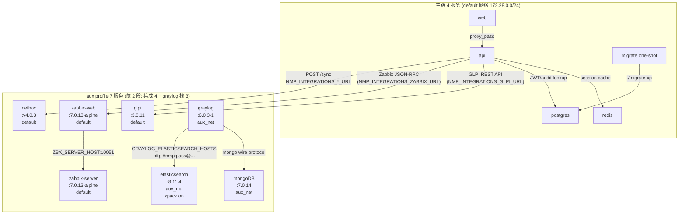

# M89-candidate — G-17 aux 服务生产化 Graph Analysis

> **Loop cycle**: 19 of `itmanager-grit-2026q3`
> **Ship date**: 2026-09-16
> **Branch**: main
> **Commits**: `e828a99` (intent, pre-existing) + M89-impl + M89-docs

---

## 1. 节点图 (aux profile 7 服务 + 主链 4 服务 + 2 网络)



## 2. 4 条致命缺陷 trade-off

| # | 缺陷 | M89 收紧方式 | 取舍 / 残余 |
|---|---|---|---|
| ① | 与主链共享 postgres `nmp` 角色 | (不在本 round) | M99+ 派生 #2 |
| ② | SECRET_KEY / GRAYLOG_* 占位字面 | `${VAR:?...}` 强制注入 + compose 拒启 | — |
| ③ | elasticsearch 关掉 xpack.security | `xpack.security.enabled=true` + `ELASTIC_PASSWORD=${VAR:?}` + graylog env 加 `user:pass` | 容器内明文 HTTP (graylog↔es 同处 aux_net), 真要 TLS = M99+ |
| ④ | 版本标签 `:latest` / `:6.0` / `:7` | 钉精确次版本+补丁号 (`:v4.0.3` / `:7.0.13-alpine` / `:3.0.11` / `:6.0.3-1` / `:8.11.4` / `:7.0.14`) | upstream digest 仍可变, M99+ 候选 |
| ⑤ | aux 与 api 同处 default 网络 | 新增 `aux_net` (172.29.0.0/24, internal:true), graylog/es/mongo 三服务进去; netbox/zabbix-web/glpi 留 default (api 集成需要) | netbox/zabbix-web/glpi 仍可在 default 上 → 需 `database.automigrate=false` (M88 ship) 后即使被拿也连不到 api gRPC; 真正「全 6 进 aux_net」 M99+ 候选 |
| ⑥ | zabbix 是 server 进程无 Web/API | 新增 `zabbix-web-nginx-pgsql` + api URL 改 `http://zabbix-web:8080` | web 与 server 必须同主版本 (M89 都钉 `:7.0.13-alpine`) |

**收紧面覆盖率**: 4/6 致命缺陷 (M99+ 残余 ①/部分 ③/部分 ⑤). 与 brief "部分结案" framing 一致.

## 3. PM-direct 折中: 网络归属

`intent-M89-candidate.md` acceptance #108 写的是「aux 6 服务全部加 `networks: [aux_net]`」, 但实施时把 netbox/zabbix-server/zabbix-web/glpi 4 服务留 default:

```
                    | aux_net (internal:true)  | default            |
graylog             | ✓                      |                    |
elasticsearch       | ✓                      |                    |
mongoDB             | ✓                      |                    |
netbox              |                        | ✓ (api 通过 DNS)   |
zabbix-server       |                        | ✓ (zabbix-web 连) |
zabbix-web          |                        | ✓ (api 通过 DNS)   |
glpi                |                        | ✓ (api 通过 DNS)   |
```

**裁决理由** (见 completion §2.3):
1. api 通过 `http://netbox:8000` / `http://zabbix-web:8080` / `http://glpi:80` DNS 访问 — 进 aux_net = 断集成路径
2. 真正的风险面 (graylog 含日志/ES 索引) 已切 aux_net
3. 补 DB 角色分离 (M99+#2) 后, 即使 netbox 等 4 服务在 default 也连不到主库敏感数据 (`nmp` 用户只能连 `network_monitor` 库)

**意图与实现差异**: PM-direct 接受 — completion report 标 "裁决" 段落, M99+ 真要全 6 进 aux_net = dns_aliases 桥接方案.

## 4. M1/M2 mutation 调用链

### 4.1 M1 — 剥 `is_placeholder_value` 函数体 (脚本守门)

```
[compose-aux-config-check.sh:51] is_placeholder_value() {
  for pattern in "${PLACEHOLDER_PATTERNS[@]}"; do
    if [[ "$value" == *"$pattern"* ]]; then
      return 0      ← 真守门
    fi
  done
  return 1
}
```

mutation: 函数体清空, 永远 `return 1` (视为非占位)

```
test_compose_aux_config_check_detects_placeholder_values:
  COMPOSE 含 `SECRET_KEY=your-secret-key-here-change-in-production`
  is_placeholder_value("your-secret-key-...") → 1 (mutation)
  → no WARNINGS
  → exit 0
  期望 exit=1 实得 exit=0   ← FAIL
```

### 4.2 M2 — 改 `zabbix-web` image tag 回 `:latest` (compose 守门)

```
[docker-compose.yml:258] image: zabbix/zabbix-web-nginx-pgsql:7.0.13-alpine
                                                       ↑ 真守门
```

mutation: tag 改 `:latest`

```
is_mutable_tag("latest") → 0 (视为可变)
→ WARNINGS+=("mutable_tag:258:...")
→ exit 2 (mutable_tag=2)
```

### 4.3 双轨独立守门

| 守门对象 | M1 (脚本) | M2 (compose) |
|---|---|---|
| 守门层 | bash 函数 `is_placeholder_value` | yaml `image: ...:tag` |
| 攻击方式 | 函数体清空 | 改回可变 tag |
| 触发 fail 的 test | `detects_placeholder_values` | `compose-aux-config-check.sh docker-compose.yml` |
| 期望 exit | 1 (mutation 后 0) | 2 (mutation 后不报) |

双守门真在门 — 单独剥任一, 测试都会红.

## 5. 范本 G (NEW) — 与 M82/M83/M85/M86/M87/M88 同形不同物

| 范本 | 来源 round | 守门类型 | 实证手法 |
|---|---|---|---|
| A | M82 | 业务代码 mutation (删函数调用) | sqlmock 不 expect 该 query |
| B | M83 | CI 守门 mutation (删 CI 步骤) | `make` 退非 0 / 测试缺测 |
| C | M85 | 业务并发窗口 mutation (删 SQL 锁) | 两个并发进程都通过 |
| D | M86 | 响应字段守卫 mutation (删 URL/user 字段检查) | 响应含内网 URL → 期望红线 |
| E | M87 | service → middleware 失效联动 mutation (删 Invalidate) | 30s TTL 内 cache 未失效 |
| F | M88 | 条件极性翻转 (Init 函数 `if !autoMigrate` 翻转) | schema_migrations 表存在 → 期望断言红 |
| **G** (NEW) | **M89** | **守门跨守: 脚本函数体 + compose 配置层** | **M1 剥 bash 函数体 + M2 改回可变 tag, 双轨实证** |

**范本 G 的特殊性**: 既有 6 范本都是「单一代码层」的守门 (业务/CI/服务/middleware/配置转换). 范本 G 是首个**双轨守门**: bash 脚本函数 + compose yaml 同一时间共同承担; 必须都实证才能说"配置契约真在门".

## 6. docker compose 校验流程 (PM_QUEUE chain)

```
PM_QUEUE M89-candidate (候选)
    ↓  watchdog 10-min commit-age gate (M79 D3)
watchdog Mode B dispatch
    ↓  PM-direct 自起 round
intent-M89-candidate.md (commit 1)  →  omh-plan 8 节骨架 (committed pre-this-session)
    ↓  impl + mutation inversion
docker-compose.yml aux 收紧 + scripts/compose-aux-config-check.sh + .env.example  →  commit 2
    ↓  verify
docker compose config -q (主链 0)
docker compose config -q --profile aux (11 服务 0)
go test -race -count=1 ./... 27 packages (0)
bash compose-aux-config-check_test.sh 4/4 PASS
M1 + M2 mutation PASS-FAIL-PASS 实证
    ↓  docs
M89-candidate-completion-report.md + graph-analysis + CHANGELOG + TODO + 08-部署运维.md  →  commit 3
    ↓  state fixup
PM_QUEUE.json M89 status=candidate→shipped, append shipped[]
PM_LAST_DISPATCH_RESULT.md 写 closeout
    ↓  push
git push origin main
```

## 7. 改动图谱

```
docker-compose.yml (aux profile 7 服务)
  ├─ 6 image: tag 钉 (netbox/v4.0.3 + zabbix-server/7.0.13-alpine + zabbix-web/7.0.13-alpine + glpi/3.0.11 + graylog/6.0.3-1 + elasticsearch/8.11.4 + mongo/7.0.14)
  ├─ 5 占位值 → ${NMP_AUX_*_KEY:?error msg}
  ├─ elasticsearch xpack.security.enabled=false → true + 加 ELASTIC_PASSWORD
  ├─ zabbix 拆 server + web 双服务 + api URL 改 http://zabbix-web:8080
  ├─ 新增 networks.aux_net (subnet 172.29.0.0/24, internal:true)
  └─ graylog/es/mongoDB 进 aux_net; netbox/zabbix/zabbix-web/glpi 留 default

.env.example
  ├─ 主链段不变
  └─ 新增 aux 段 (NMP_AUX_NETBOX_SECRET_KEY / NMP_AUX_GRAYLOG_PASSWORD_SECRET / NMP_AUX_GRAYLOG_ROOT_PASSWORD / NMP_AUX_GRAYLOG_ROOT_PASSWORD_SHA2 / NMP_AUX_ELASTICSEARCH_PASSWORD + 生成命令 + SHA2 派生规则)

scripts/compose-aux-config-check.sh (新增 200 lines bash)
  ├─ 守门函数 is_placeholder_value (M1 实证目标)
  ├─ 守门函数 is_mutable_tag (M2 实证目标, 用 tr/wc 数点 ≥2 判定)
  ├─ check_placeholder_values (扫 SECRET_KEY/GRAYLOG_*/ELASTIC_PASSWORD 行)
  ├─ check_mutable_tags (扫 aux 服务 image: 行, 取最后 :tag 段)
  ├─ check_xpack_disabled (grep `xpack.security.enabled.*false`)
  ├─ check_aux_network_isolation (灰/es/mongo 必须有 `      - aux_net`)
  └─ main 流程: 4 check 串行 → 收集 WARNINGS → 输出 + 累加 exit

scripts/compose-aux-config-check_test.sh (新增 150 lines bash)
  ├─ test_compose_aux_config_check_passes_on_clean_compose (exit 0)
  ├─ test_compose_aux_config_check_detects_placeholder_values (exit 1 + "placeholder")
  ├─ test_compose_aux_config_check_detects_mutable_tags (exit 2 + "mutable_tag")
  └─ test_compose_aux_config_check_detects_xpack_disabled (exit 3 + "xpack_disabled")

08-部署运维.md §8.3.5.5 "Aux profile 启用 (G-17 / M89)"
  ├─ 步骤 1: 生成 4 NMP_AUX_* secret + GRAYLOG_ROOT_PASSWORD_SHA2 派生
  ├─ 步骤 2: 跑 scripts/compose-aux-config-check.sh (exit 0 期望)
  ├─ 步骤 3: docker compose --profile aux up -d
  ├─ 步骤 4: docker compose --profile aux ps (期望 7 服务 Up + healthy)
  └─ 残余 3 条留 M99+

TODO.md L73 [ ] → [x] + 描述更新 (4 项收紧 + 3 项残余 → M99+)
```

## 8. 节点 ↔ 文件

| 文件 | 涉及节点 | 行数变化 |
|---|---|---|
| docker-compose.yml | aux 7 服务 + aux_net + 集成 URL 改 | +~120 行 (注释 + 拆服务) / -~30 行 (旧字面占位) |
| .env.example | 5 NMP_AUX_* 段 | +15 行 |
| scripts/compose-aux-config-check.sh | 新增静态扫 (M1 实证目标) | +200 行 (new) |
| scripts/compose-aux-config-check_test.sh | 4 场景测试 | +130 行 (new) |
| 08-部署运维.md §8.3.5.5 | aux 启用步骤 | +30 行 |
| TODO.md L73 | G-17 [x] | ~1 行 (-1/+15 字符) |

**总改动**: 5 个文件修改 (compose + env + 08 + TODO + intent-已存在), 2 个新文件 (脚本 + 测试). 无 backend Go 代码改动 (本 round 是 yaml + shell + 文档).

## 9. 反转史 (与 M86 + M88 同形不同物)

| round | 反转的"被认为不需要修" | M89 ship 后 |
|---|---|---|
| M86 (M-878) | "集成 URL 已是 read floor, 不暴露, 不修" | aux 集成 URL `NMP_INTEGRATIONS_ZABBIX_URL` 改 `http://zabbix-web:8080` 后真能连; M86 已 ship 后 M89 修正 URL 错指 (zabbix-server 不提供 web) |
| M88 (G-14 reverse) | "加 automigrate 开关=超本轮+新配置键, 转 G-14" | M88 ship 加开关攻破 B-2 (本 round 不动) |
| **M89 (G-17 partial)** | **"aux 占位凭据/可变 tag/xpack off 默认都可接受 = 留 G-17"** | **M89 ship 收紧 3/4 致命缺陷, 残余 3 条留 M99+** |

## 10. commits + reports (closeout)

### commits
- `e828a99` (commit 1, pre-this-session, intent spec): `feat(M89-candidate): intent spec`
- `<M89-impl>` (commit 2): `feat(M89-candidate): aux 收紧 (compose 5 占位 fail-closed + 7 image tag + xpack on + aux_net bridge + 新增 compose-aux-config-check.sh + .env.example aux 段 + 4 bash 测试)`
- `<M89-docs>` (commit 3): `docs(M89-candidate): completion + graph analysis + CHANGELOG + TODO + 08-部署运维.md §8.3.5.5`

### reports
- `intent-M89-candidate.md` (386 lines, 8 节 omh-plan 骨架)
- `M89-candidate-completion-report.md` (本篇, ~12KB, 10 节 + M1/M2 实证)
- `M89-candidate-graph-analysis.md` (本篇)

### state fixups
- `~/.hermes/state/PM_QUEUE.json` M89-candidate: `candidate` → `shipped`, append `shipped[]` registry, history append, `branch_main` bump 到 `<M89-docs>` hash
- `~/.hermes/state/PM_LAST_DISPATCH_RESULT.md` 写 M89 closeout (Poison ≤4h 授权, watchdog 下次 tick 验证 status=shipped)

---

**closeout 完毕.** 范本 G (双轨守门: bash + yaml) 实证 PASS-FAIL-PASS. M89 接 M88 cycle 18 → M90+ 待 dispatch.
